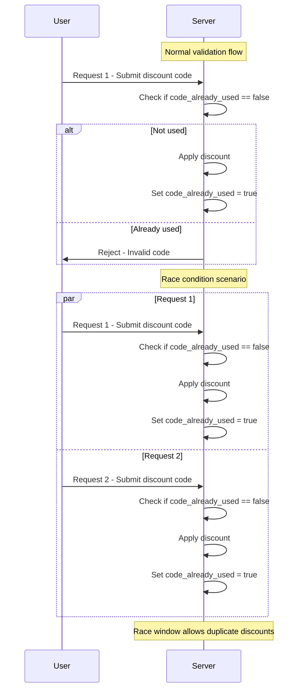

# Race conditions [PortSwigger Academy]

This write-up covers the Race conditions section of Web Security Academy by PortSwigger.

## Limit overrun race conditions

One of the most common types of race conditions allows attackers to bypass restrictions defined by an application's business logic. 

For instance, imagine an online shop that lets users apply a promo code for a one-time discount at checkout. The application might follow these general steps:

1. Verify that the promo code hasn't been used by the user yet.
2. Apply the discount to the total order amount.
3. Update the database to indicate that the code has now been used.

### Limit overrun race conditions - Continued

Ordinarily, the workflow prevents re-using a one-time promo code: a request checks whether the code has already been redeemed, and if the answer is __true__ the discount is refused.

But if a customer submits two discount-code requests almost simultaneously, both reach the server while it is still in a transient state where __`code_already_used = false`__.

Because the database flag is only updated at the end of each request, both threads pass the check and each applies the discount before the flag is set. This brief period --- the _race window_ ---  lets an attacker redeem the same “one‑time” code multiple times.

