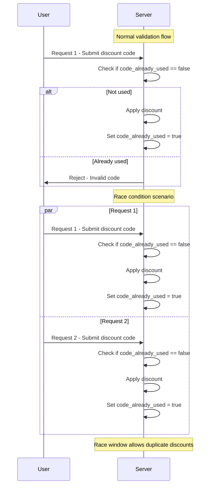
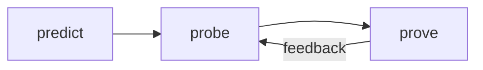
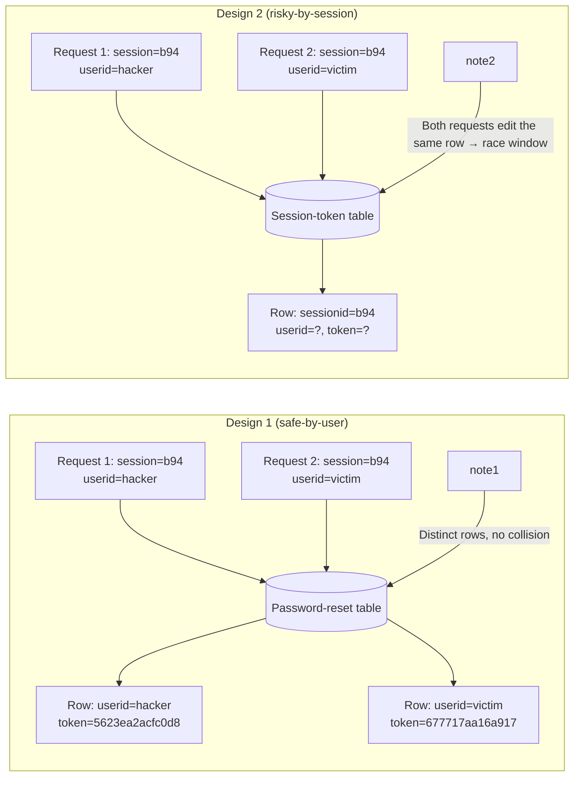

# Race conditions [PortSwigger Academy]

<sup>This write-up covers the Race conditions section of Web Security Academy by PortSwigger.</sup>

## Limit overrun race conditions

One of the most common types of race conditions allows attackers to bypass restrictions defined by an application's business logic. 

For instance, imagine an online shop that lets users apply a promo code for a one-time discount at checkout. The application might follow these general steps:

1. Verify that the promo code hasn't been used by the user yet.
2. Apply the discount to the total order amount.
3. Update the database to indicate that the code has now been used.

### Limit overrun race conditions - Continued

Ordinarily, the workflow prevents re-using a one-time promo code: a request checks whether the code has already been redeemed, and if the answer is __true__ the discount is refused.

But if a customer submits two discount-code requests almost simultaneously, both reach the server while it is still in a transient state where __`code_already_used = false`__.

Because the database flag is only updated at the end of each request, both threads pass the check and each applies the discount before the flag is set. This brief period --- the _race window_ ---  lets an attacker redeem the same “one‑time” code multiple times.



### Limit overrun race conditions - Continued

This type of attack can take many forms, such as:

- Using a gift card more than once
- Submitting multiple ratings for the same product
- Withdrawing or transferring funds beyond the available balance
- Reusing the same CAPTCHA response
- Circumventing brute-force protection mechanisms

These scenarios represent a class of issues known as __limit overruns__, which are a specific kind of __time-of-check to time-of-use (TOCTOU)__ vulnerability. Later, we'll explore other race conditions examples that don't fit neatly into these categories. 

## Detecting and exploiting limit overrun race conditions with Burp Repeater

Exploiting race conditions that allow limit overruns is fairly straightforward conceptually:

1. Find an endpoint that's meant to be used only once or has rate limiting, and that influences security or behavior meaningfully.
2. Find several requests to this endpoint almost simultaneously in hopes of bypassing the restriction.

The real difficulty lies in synchronizing the requests so that two or more enter the critical race window at the same time. This window might last only a few milliseconds --- or even less. 

Even if you fire requests concurrently, variables like network latency, jitter, and the server's internal processing order introduce uncertainty and make success unpredictable. 

This simulates two requests with overlapping internal processing times, illustrating a race window where both hit a critical operation concurrently.

### Detecting and exploiting limit overrun race conditions with Burp Repeater - Continued

__Burp Suite 2023.9__ introduces enhanced functionality in __Burp Repeater__ that lets you fire off multiple requests in parallel, significantly minimizing the effects of __network jitter__. Burp automatically selects the best method based on the server's supported HTTP version:

- For __HTTP/1__, it uses the traditional _last-byte synchronization_ technique.
- For __HTTP/2__, it applies the more advanced _single-packet attack_ technique, originally presented by PortSwigger Research at __Black Hat USA 2023__. 

The __single-packet attack__ allows up to 20-30 requests to be completed in a single TCP packet, virtually eliminating network jitter.

Although exploiting a race condition might only require two well-timed requests, blasting a larger number can help smooth out __internal (server-side) latency__ --- which is particularly useful during the early stages of testing. This methodology will be discussed more in depth later.

### Lab: Limit overrun race conditions

Log in as `wiener:peter` and find the cheapest possible item, add it to cart. 

In the cart, try applying the provided coupon code to your purchase. 

Find `POST /cart/coupon` request in proxy history and send it to repeater.

Notice that if you resend the request it returns:

```
HTTP/2 302 Found
Location: /cart?couponError=COUPON_ALREADY_APPLIED&coupon=PROMO20
X-Frame-Options: SAMEORIGIN
Content-Length: 22

Coupon already applied
```

Now find `GET /cart` request in proxy history and send it to repeater. First, send it with session cookie. Observe that it responds with your item in the cart:

```html
<td>
  <a href=/product?productId=12>
    Paint a rainbow
  </a>
</td>
```

Now send the same request only without a session cookie. Observe that this time it returned an empty cart:

```html
<p>
  Your cart is empty
</p>
```

This means that the state of the cart is stored server-side in the session and any operations on the cart are keyed on the session ID or the associated user ID. 

Consider that there may be a race window between when you first apply a discound code and when the database is updated to reflect that you've done this already. 

Make sure you have something in cart and locate `POST /cart/coupon` request in __Repeater__. Create a new tab group and add this request to it. 

Right-click the request tab (now inside the group) and click "Duplicate tab", create 19 duplicates. 

Click on the group tab and in the dropdown next to "Send" button, select "Send group in parallel". 

Go through all requests within that group and observe that some of them returned "Coupon applied" message. Refresh the cart page and see that the promo code was applied several times and the order total is much less than 80% of the price. 

To solve the lab, remove everything from cart, add Lightweight "l33t" Leather Jacket to cart and send the group of tabs from Repeater again. Refresh the page, if the order total is less than you store credit, make a purchase and solve the lab.

> NOTE: I couldn't replicate this with ZAP, but in my attempt to do so I created a decent [script](https://github.com/gremlin-0x/blaster) that works with ZAP and tests race condition vulnerabilities.

## Detecting and exploiting limit overrun race conditions with Turbo Intruder

Alongside adding built-in single-packet-attack capabilities to Burp Repeater, we've updated the __Turbo Intruder__ extension so it can leverage the same technique. The latest release is available from the BApp Store. While Turbo Intruder assumes you're comfortable writing Python, it's ideal for more sophisticated scnearios --- such as tests that need numerous retries, carefully staggered request timing or very high request volumes.

### Detecting and exploiting limit overrun race conditions with Turbo Intruder

To execute a single-packet attack with Turbo Intruder:

1. Confirm the target server supports HTTP/2; this technique won't work over HTTP/1.
2. Configure the request engine with `engine=Engine.BURP2` and set `concurrentConnections=1`
3. While queuing, assign each request to a group (or "gate") using the `gate` parameter in `engine.queue()`.
4. After all desired requests are queued under that gate, release them simultaneously with `engine.openGate()`.

```python
def queueRequests(target, wordlists):
    engine = RequestEngine(endpoint=target.endpoint,
                            concurrentConnections=1,
                            engine=Engine.BURP2
                            )
    
    # queue 20 requests in gate '1'
    for i in range(20):
        engine.queue(target.req, gate='1')
    
    # send all requests in gate '1' in parallel
    engine.openGate('1')
```

For a full reference implementation, see the `race-single-packet-attack.py` template in Turbo Intruder's examples folder.

### Lab: Bypassing rate limits via race conditions

Detecting and Exploiting a Per-Username Rate-Limit Race Condition

1. Confirm the limit – Deliberately enter the wrong password for your own account and note that after three failures the site blocks further attempts for that username. Try a different username and see only the usual “Invalid username or password” message, revealing the lock applies per user and that a counter is stored server-side.

2. Spot the race window – A gap must exist between the moment you submit a login and the point at which the server increments that failure counter; two requests landing inside this window could both be accepted.

3. Benchmark the threshold – Locate a failed POST /login request in Proxy ▶ HTTP history and send it to Burp Repeater. Place the tab in a group, duplicate it 19 times, then transmit the requests sequentially over separate connections. As expected, you are locked out after two additional failures, confirming the limit still applies under normal conditions.

4. Probe in parallel – Resend the same group in parallel and observe that several requests still return “Invalid username or password” even though the lock triggers. This shows you can slip extra attempts through if they arrive together.

5. Build a proof of concept

  - In one Repeater tab, highlight the password value and choose Extensions ▶ Turbo Intruder ▶ Send to turbo intruder.

  - Replace the username parameter with carlos.

  - Select examples/race-single-packet-attack.py and adapt the script so each candidate password is queued once and withheld behind gate '1'. All requests are then released simultaneously via engine.openGate('1'):

```python
def queueRequests(target, wordlists):

    # single-packet attack: HTTP/2, one connection
    engine = RequestEngine(endpoint=target.endpoint,
                           concurrentConnections=1,
                           engine=Engine.BURP2)

    # candidate passwords copied to clipboard
    passwords = wordlists.clipboard

    # queue one request per password behind gate '1'
    for password in passwords:
        engine.queue(target.req, password, gate='1')

    # fire every queued request at the same instant
    engine.openGate('1')


def handleResponse(req, interesting):
    table.add(req)
```

  - Copy your wordlists to the clipboard and launch the attack.

6. Identify the valid password – In the results table, a 302 redirect indicates a successful login; note the corresponding password. After the lock resets, sign in as carlos with that password, open the admin panel, and delete the carlos user to complete the lab.

## Hidden multi-step sequences

In many cases, a single HTTP request triggers a chain of internal actions, moving the application through several temporary "sub-states" that exist only briefly during processing. 
If you can find multiple requests that interact with the same underlying data, you may be able to exploit these fleeting sub-states to uncover time-sensitive logic flaws --- similar to those seen in multi-step workflows --- leading to race-condition attacks that are far more powerful than simple limit overruns.

One classic example is an insecure multi-factor authentication flow: you submit the correct username and password, then use forced browsing to jump directly into the app and sidestep the second authentication factor altogether. 

### Hidden multi-step sequences - Continued

Consider this simplified server-side logic:

```python
session['userid'] = user.userid
if user.mfa_enabled:
    session['enforce_mfa'] = True
    # send MFA code
    # redirect user to MFA entry page
```

Although it appears to be a single operation, it actually runs through multiple hidden steps inside one request. Critically, there is a brief sub-state in which the session is marked as logged-in (`userid` set) but the MFA flag has not yet been applied. During that tiny window, an attacker could submit a normal login request and, almost simultaneously hit a privileged endpoint --- gaining access before the server starts enforcing MFA. Later we'll explore other vulnerabilities that rely on similar "in-request" sub-states, and you can practice exploiting them in the labs. Because these flaws depend heavily on an application's internal flow, you'll need a systematic approach to uncover them both in the training environment and in real-world testing. 

## Methodology

PortSwigger Reasearch's whitepaper _"Smashing the State Machine: The True Potential of Web Race Conditions"_ outlines a systematic approach for uncovering and exploiting these hidden, multi-step states; the steps below distill that methodology:



### 1 - Predict potential collisions

Because it's unrealistic to probe every single endpoint, first map the application as usual, then narrow your focus with two key questions:

1. Is the endpoint security-critical? --- If a feature doesn't touch sensitive logic or data, you can usually skip it.

2. Is there collision potential? --- Race conditions generally require two or more simultaneous requests that modify the same record:
  - Good design: each password-reset request updates a row that iskeyed by the specific user ID. Parallel resets for two different users touch different rows, so a collision is unlikely.
  - Risky design: the application stores the reset token in a row keyed only by the session ID. Two parallel requests for different users now compete to update the same row, creating a race window. 



The first schema isolates each user's token, whereas the second funnels multiple users through a single session-scoped record, making it vulnerable to race-condition collisions.

### 2 - Probe for clues

Begin by establishing a performance baseline for the endpoint: in Burp Repeater, place all relevant requests into a group, then choose Send group in sequence (separate connections) to measure how each behaves under normal conditions. 

Afterward, fire the same set simultaneously --- using the single-packet technique (or last-byte synchronization if the server doesn't support HTTP/2) --- via Send group in parallel to eliminate network jitter; Turbo Intruder from the BApp Store can achieve the same effect. 

Compare the parallel run with your baseline and watch for any deviation: altered response bodies or headers, unexpected email content, or subtle changes in the application's state. Even small discrepancies may signal a race-condition weakness worth probing further. 

### 3 - Prove the concept

Work out exactly what's going on, strip away any unnecessary requests, and confirm you can still reproduce the behavior. Complex race conditions often produce odd, one-off exploitation primitives, so the optimal way to leverage them may not be clear at first. Treat each race condition as an underlying structural flaw in the system rather than a single, standalone bug. 

## Multi-endpoint race conditions

When two or more requests hit dependent endpoints at the same moment, subtle timing gaps can reopen well-known business-logic flaws. A classic shop exploit lets you pay for the cart, then sneak extra items in before you visit the order-confirmation page. A tighter variant appears when both __payment validation__ and __order confirmation__ happen inside one backend request: After the server flags the payment as valid but before it commits the order, there's a brief race window in which you can still modify the basket and add goods for free. 


The request transitions from __basket pending__ → __payment validated__ (vulnerable sub-state) → __basket confirmed__.

If you change the cart during the dashed-line race window, the extra items slip through unpaid. 

### Aligning multi-endpoint race windows

When you test race conditions that involve two different endpoints, you can fire both requests simultaneously --- using a single-packet or last-byte-sync burst --- yet their critical sections may still fail to overlap. Two main factors throw them out of alignment: 

- __(1) Network-level delays__, such as extra handshakes or protocol overhead when the front-end opens a fresh back-end connection, and 

- __(2) Endpoint-specific processing time__, because one route might perform heavier business logic than the other. 

These discrepancies create different internal-latency profiles, so one request reaches its vulnerable code later than the other, leaving no collision window. 

Thankfully, techniques such as pre-warming back-end connections or padding the faster request with intentional delay can help you bring the two race windows together. 

### Connection warming

Delays caused by back-end connection setup generally don't break race-condition tests because they tend to affect all parallel requests equally, keeping them aligned. The key is to tell these connection delays apart from variations that step from the individual endpoints themselves. A simple technique is to "warm up" the connection: fire one or two harmless requests first and see whether subsequent requests complete in a tighter time window. In Burp Repeater you can prepend a trivial `GET` (for example, the site's homepage) to your tab group and send the group __in sequence on a single connection__. 

If only the very first request remains slow while the rest cluster closely together, you can disregard that initial lag and proceed with your testing.

However, if response times for a single endpoint still vary widely --- even when you employ the single-packet (or last-byte-sync) method --- then back-end latency is likely undermining your attack. In that case, try using Turbo Intruder: send a few connection-warming requests first, then immediately queue and release your actual exploit requests. 

### Lab: Multi-endpoint race conditions

- Log in, purchase a gift card, and observe the entire checkout flow.

- Decide that the cart logic—especially the rules controlling what can be ordered—is a prime target for bypass.

- From __Proxy > HTTP history__, list every cart-related endpoint (e.g., `POST /cart` to add items, `POST /cart/checkout` to submit the order).

- Add another gift card, then send `GET /cart` to Repeater.

- Send it once with your session cookie and once without: the cookie-less request shows an empty cart.

- Conclusion: cart contents are stored server-side and keyed to your session or user ID—two requests on the same session could clash.

- Note that order validation and confirmation happen in one request/response cycle; a race window may exist after the server checks your balance but before it locks in the order, letting you slip in extra items.

- Send `POST /cart` (add item) and `POST /cart/checkout` to Repeater and place them in a new tab group.

- Run the pair in sequence on a single connection a few times; `POST /cart` is always slower.

- Add a harmless `GET /` request at the top of the group to “warm” the connection, then rerun. The first request is still slower, but the second and third complete almost together—showing the lag is network-startup, not endpoint logic.

- Remove the warming `GET`, leave a single gift card in the cart, and change `productId` in the `POST /cart` request to `1` (the Leather Jacket).

- Run the pair sequentially again—checkout fails with insufficient funds, as expected.

- Delete the jacket, add an extra gift card, so funds look sufficient.

- Fire the two requests in parallel (single-packet / last-byte sync).

To solve the lab: warm the connection, measure baseline timings, then unleash the add-item and checkout requests simultaneously; if their critical sections overlap, you buy the jacket without paying the full cost.

