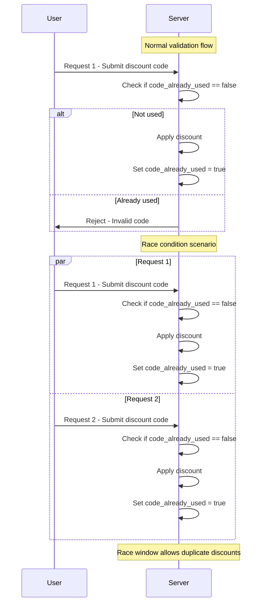

# Race conditions [PortSwigger Academy]

<sup>This write-up covers the Race conditions section of Web Security Academy by PortSwigger.</sup>

## Limit overrun race conditions

One of the most common types of race conditions allows attackers to bypass restrictions defined by an application's business logic. 

For instance, imagine an online shop that lets users apply a promo code for a one-time discount at checkout. The application might follow these general steps:

1. Verify that the promo code hasn't been used by the user yet.
2. Apply the discount to the total order amount.
3. Update the database to indicate that the code has now been used.

### Limit overrun race conditions - Continued

Ordinarily, the workflow prevents re-using a one-time promo code: a request checks whether the code has already been redeemed, and if the answer is __true__ the discount is refused.

But if a customer submits two discount-code requests almost simultaneously, both reach the server while it is still in a transient state where __`code_already_used = false`__.

Because the database flag is only updated at the end of each request, both threads pass the check and each applies the discount before the flag is set. This brief period --- the _race window_ ---  lets an attacker redeem the same “one‑time” code multiple times.



### Limit overrun race conditions - Continued

This type of attack can take many forms, such as:

- Using a gift card more than once
- Submitting multiple ratings for the same product
- Withdrawing or transferring funds beyond the available balance
- Reusing the same CAPTCHA response
- Circumventing brute-force protection mechanisms

These scenarios represent a class of issues known as __limit overruns__, which are a specific kind of __time-of-check to time-of-use (TOCTOU)__ vulnerability. Later, we'll explore other race conditions examples that don't fit neatly into these categories. 

## Detecting and exploiting limit overrun race conditions with Burp Repeater

Exploiting race conditions that allow limit overruns is fairly straightforward conceptually:

1. Find an endpoint that's meant to be used only once or has rate limiting, and that influences security or behavior meaningfully.
2. Find several requests to this endpoint almost simultaneously in hopes of bypassing the restriction.

The real difficulty lies in synchronizing the requests so that two or more enter the critical race window at the same time. This window might last only a few milliseconds --- or even less. 

Even if you fire requests concurrently, variables like network latency, jitter, and the server's internal processing order introduce uncertainty and make success unpredictable. 

This simulates two requests with overlapping internal processing times, illustrating a race window where both hit a critical operation concurrently.

### Detecting and exploiting limit overrun race conditions with Burp Repeater - Continued

__Burp Suite 2023.9__ introduces enhanced functionality in __Burp Repeater__ that lets you fire off multiple requests in parallel, significantly minimizing the effects of __network jitter__. Burp automatically selects the best method based on the server's supported HTTP version:

- For __HTTP/1__, it uses the traditional _last-byte synchronization_ technique.
- For __HTTP/2__, it applies the more advanced _single-packet attack_ technique, originally presented by PortSwigger Research at __Black Hat USA 2023__. 

The __single-packet attack__ allows up to 20-30 requests to be completed in a single TCP packet, virtually eliminating network jitter.

Although exploiting a race condition might only require two well-timed requests, blasting a larger number can help smooth out __internal (server-side) latency__ --- which is particularly useful during the early stages of testing. This methodology will be discussed more in depth later.

### Lab: Limit overrun race conditions

Log in as `wiener:peter` and find the cheapest possible item, add it to cart. 

In the cart, try applying the provided coupon code to your purchase. 

Find `POST /cart/coupon` request in proxy history and send it to repeater.

Notice that if you resend the request it returns:

```
HTTP/2 302 Found
Location: /cart?couponError=COUPON_ALREADY_APPLIED&coupon=PROMO20
X-Frame-Options: SAMEORIGIN
Content-Length: 22

Coupon already applied
```

Now find `GET /cart` request in proxy history and send it to repeater. First, send it with session cookie. Observe that it responds with your item in the cart:

```html
<td>
  <a href=/product?productId=12>
    Paint a rainbow
  </a>
</td>
```

Now send the same request only without a session cookie. Observe that this time it returned an empty cart:

```html
<p>
  Your cart is empty
</p>
```

This means that the state of the cart is stored server-side in the session and any operations on the cart are keyed on the session ID or the associated user ID. 

Consider that there may be a race window between when you first apply a discound code and when the database is updated to reflect that you've done this already. 

Make sure you have something in cart and locate `POST /cart/coupon` request in __Repeater__. Create a new tab group and add this request to it. 

Right-click the request tab (now inside the group) and click "Duplicate tab", create 19 duplicates. 

Click on the group tab and in the dropdown next to "Send" button, select "Send group in parallel". 

Go through all requests within that group and observe that some of them returned "Coupon applied" message. Refresh the cart page and see that the promo code was applied several times and the order total is much less than 80% of the price. 

To solve the lab, remove everything from cart, add Lightweight "l33t" Leather Jacket to cart and send the group of tabs from Repeater again. Refresh the page, if the order total is less than you store credit, make a purchase and solve the lab.

> NOTE: I couldn't replicate this with ZAP, but in my attempt to do so I created a decent [script](https://github.com/gremlin-0x/blaster) that works with ZAP and tests race condition vulnerabilities.
